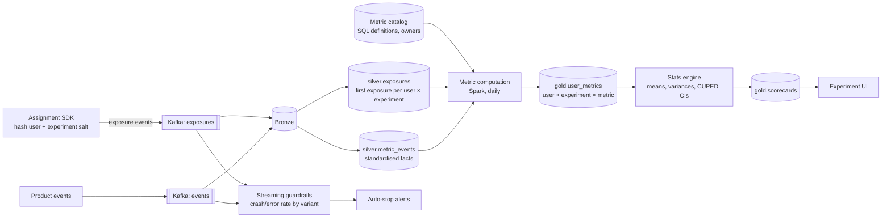

# Design the Data Pipeline for an A/B Testing Platform

## Problem

Product teams run ~300 concurrent experiments. Each needs a daily scorecard: per variant, dozens of metrics (conversion, revenue per user, retention, latency) with confidence intervals. Design the data side: assignment and exposure logging, metric definitions, computation at scale, and trust checks.

---

## Clarifying questions

| Question | Assumed answer |
|---|---|
| Users? | 100 M monthly active users; each user in ~20 experiments at once |
| Randomisation unit? | Mostly user; some by device or session |
| Freshness? | Daily scorecards; real-time guardrail alerts for severe regressions (crash rate, errors) |
| Metrics? | 500 defined metrics in a central catalog, owners per metric |
| Analysis? | Frequentist with CUPED variance reduction; sequential testing for peeking |

## 1. Architecture



## 2. Deep dives

### 2.1 Assignment vs exposure

- **Assignment** is deterministic: `variant = hash(user_id + experiment_salt) % 100 → bucket → variant`. No database lookup is needed, and it's reproducible.
- **Exposure** = the moment the user actually experienced the difference (saw the new checkout page). Analyse only exposed users (**triggered analysis**) to avoid diluting effects with users who never reached the feature.
- `silver.exposures`: one row per (experiment, user) with **first exposure timestamp** and variant; metrics count only events after first exposure.

### 2.2 Metric computation at scale

Naive: for each of 300 experiments × 500 metrics, join exposures with events → 150k big joins. Instead:

1. Compute **user-day metric facts once**: `user_id, date, metric_id, value` (or wide per metric group), shared by all experiments.
2. Join each experiment's exposures (user, variant, first_exposure_date) to the user-day facts, filtering `date >= first_exposure_date`.
3. Aggregate to **sufficient statistics** per experiment × variant × metric: `n, sum, sum_of_squares` (+ covariates for CUPED). The stats engine only needs these small rows.

```sql
SELECT e.experiment_id, e.variant, f.metric_id,
       COUNT(DISTINCT e.user_id)                     AS n,
       SUM(f.user_value)                              AS sum_x,
       SUM(f.user_value * f.user_value)               AS sum_x2
FROM silver.exposures e
JOIN (SELECT user_id, metric_id, SUM(value) AS user_value
      FROM silver.user_day_metrics WHERE date BETWEEN :start AND :end
      GROUP BY 1, 2) f
  ON f.user_id = e.user_id
GROUP BY 1, 2, 3;
```

(Users with zero events must count as zeros: left join from exposures and coalesce, a classic bug when they're missed.)

### 2.3 Trust checks (what makes results believable)

| Check | What it catches |
|---|---|
| **Sample Ratio Mismatch (SRM)** chi-square test on variant counts | Broken assignment/logging, bot filtering asymmetry |
| A/A tests | Platform bugs, inflated false-positive rate |
| Pre-period balance | Randomisation problems |
| Novelty/primacy effects | Time-sliced results |
| Interaction checks between overlapping experiments | Conflicting experiments on the same surface |

### 2.4 Variance reduction (CUPED)

Use each user's **pre-experiment** value of the metric as a covariate: `Y_adj = Y − θ (X_pre − mean(X_pre))`. Often cuts variance 30–50% → same power with fewer users or shorter experiments. Data requirement: pre-period metric values per user, computed from the same user-day facts.

### 2.5 Metric catalog

Central, versioned SQL definitions (numerator/denominator, unit, filters, owner), with review. Ratio metrics (e.g. revenue per session) need the **delta method** for correct variance because the unit of analysis (user) ≠ the metric unit (session).

## 3. Trade-offs

| Decision | Choice | Alternative |
|---|---|---|
| Computation | Shared user-day facts + sufficient statistics | Per-experiment raw joins (cost explodes) |
| Analysis population | Triggered (exposed) users | All assigned users (diluted, but simpler) |
| Freshness | Daily + streaming guardrails | Real-time scorecards (peeking problems, cost) |
| Peeking | Sequential testing / fixed horizon | Look daily with fixed-horizon stats (inflated false positives) |

## 4. What separates a senior answer

- Separates **assignment from exposure**, and does triggered analysis.
- Scalable computation via **shared facts and sufficient statistics**.
- **SRM and A/A** checks as data-quality gates on results.
- Knows **CUPED**, **delta method**, **peeking**.
- Zero-filling non-active users.

## 5. Follow-up questions

<details><summary>SRM detected: 50.8% vs 49.2% with 2M users. What do you do?</summary>

Don't trust the results. The p-value is tiny at this sample size. Investigate: exposure logging differences between variants (e.g. treatment page loads slower, so more users bounce before the exposure event fires), bot filtering, assignment bugs, redirects. Fix and rerun; slicing by platform/browser often localises the cause.
</details>

<details><summary>How would you experiment on a two-sided marketplace (riders and drivers)?</summary>

User-level randomisation causes interference (treatment riders take supply from control riders). Use cluster randomisation (by city/region) or switchback designs (alternate treatment over time slots per region), with analysis adjusted for clustering.
</details>

---

## Self-assessment rubric

- [ ] Deterministic assignment, exposure logging, triggered analysis
- [ ] Metric catalog with versioned definitions
- [ ] Scalable computation: shared facts, sufficient stats, zero-filling
- [ ] SRM / A/A trust checks
- [ ] Variance reduction and ratio metric variance
- [ ] Streaming guardrails for severe regressions
