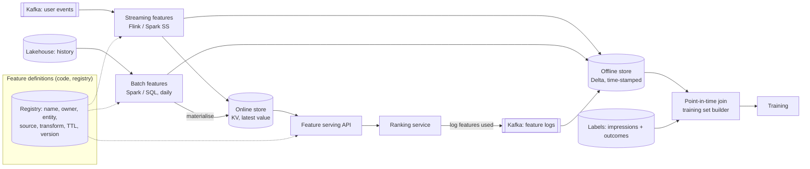
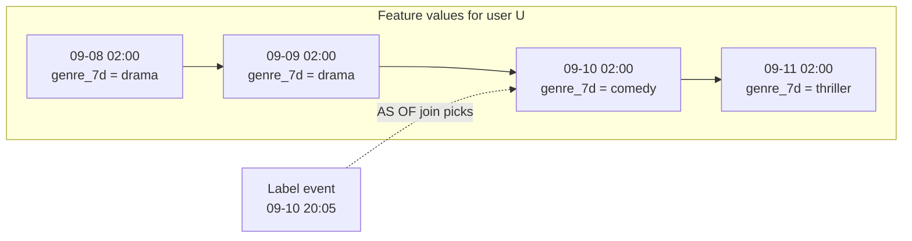

# Design a Feature Platform for Recommendations

## Problem

A streaming service (video or music) wants to rank content per user in real time. ML engineers need features like "genres watched in the last 7 days", "items interacted with in this session", "item popularity in the last hour", both for **training** (on history) and **inference** (p99 < 30 ms for feature retrieval). Design the feature platform.

---

## Clarifying questions

| Question | Assumed answer |
|---|---|
| Users / items? | 200 M users, 5 M items |
| Inference QPS? | 50k ranking requests/s at peak, each needs features for 1 user + 500 candidate items |
| Feature freshness? | Batch features daily; session features within seconds |
| Number of features? | ~500 features across many teams |
| Training cadence? | Daily retrain on 30 days of impressions with labels (clicked/played > 30 s) |

## 1. Estimates

```
Online lookups: 50k req/s × (1 user + 500 items) → item features must be cached in the ranking service (5M items × 2 KB = 10 GB, fits in memory, refreshed hourly)
User features: 50k lookups/s × ~5 KB → 250 MB/s reads → Redis/Cassandra/DynamoDB cluster
Online store size: 200M users × 5 KB = 1 TB → sharded KV store
Training data: 2B impressions/day × 30 days × ~500 features → TB-scale point-in-time joins → Spark
```

## 2. Architecture



## 3. Deep dives

### 3.1 Point-in-time correctness (the #1 topic)

Training example: user U saw item I at `t = 2026-09-10 20:05` and played it. The features must be the values **as known at 20:05**, not today's values.



```python
# Spark: AS-OF join via window, or Delta/Databricks feature engineering `timestamp_lookup_key`
from pyspark.sql import Window
joined = (labels.join(features, "user_id")
          .where(features.feature_ts <= labels.event_ts)
          .withColumn("rn", row_number().over(
              Window.partitionBy("impression_id").orderBy(col("feature_ts").desc())))
          .where("rn = 1"))
```

Leakage sources: joining current features, features computed with data after the event (e.g. a daily batch at 02:00 on 09-11 that includes 09-10 evening), label leakage via features derived from the outcome itself.

**Feature logging** (log the exact features used at serving time) eliminates skew for those features: train on what you served.

### 3.2 Training/serving skew

Same feature, two implementations (SQL for training, Java for serving) → different values → offline AUC great, online results poor. Fixes:
- Single definition in the registry, compiled to both batch and streaming execution.
- Online values materialised **from the same pipeline** that writes the offline store.
- Monitoring: compare distributions of logged online features vs offline recomputation daily.

### 3.3 Streaming session features

Session features ("last 10 items played in this session", "time since last play") must be fresh within seconds. Flink keyed by user_id updates a small state and writes to the online store; the same events are appended to the offline store with timestamps so training can replay them point-in-time.

### 3.4 Online store design

- Key: `entity_type:entity_id` → hash of feature_group → values (+ `feature_ts` per group).
- **Batch writes** must not overwhelm the store: bulk load (e.g. DynamoDB import, Cassandra SSTable loads) or rate-limited upserts; write only changed values.
- TTLs per feature group; default values on miss; versioned feature groups for safe schema changes (`user_profile_v3`).
- Item features: small enough to replicate into each ranking service instance → no network hop for 500 candidates.

### 3.5 Governance and discovery

Registry with owners, descriptions, lineage (source tables), freshness SLAs, usage (which models use it). Deprecation workflow. PII flags (no raw PII as features; use derived signals).

## 4. Trade-offs

| Decision | Choice | Alternative |
|---|---|---|
| Build vs buy | Managed feature store on the lakehouse (Databricks/Feast/Tecton) | Custom: only at very large scale/specific needs |
| Online store | Redis (latency) / DynamoDB (ops) / Cassandra (scale, multi-DC) | Lakehouse serving (too slow for 30 ms) |
| Item features | In-process cache | Remote lookup ×500 (latency) |
| Training data | Logged features + PIT joins for new features | PIT joins only (skew risk) |

## 5. Failure modes

| Failure | Handling |
|---|---|
| Online store partial outage | Defaults + degraded-mode flag; model trained with missing-value handling |
| Stale batch features (job failed) | Freshness monitor per feature group; serve previous values with staleness metadata; alert owner |
| Feature drift | Distribution monitoring (PSI) offline vs online |
| Backfill of a new feature | Compute historically with PIT semantics; parity-check vs streaming values on overlap |

## 6. What separates a senior answer

- Leads with **point-in-time correctness** and **training/serving skew**.
- Proposes **feature logging**.
- Splits item vs user feature serving based on the estimate (500 candidates!).
- Registry/governance for 500 features across teams.

## 7. Follow-up questions

<details><summary>How do you add a new feature and train on 30 days of history immediately?</summary>

Backfill the feature's offline history using its batch definition with time-travel/AS-OF semantics (values as of each day), validate parity with the streaming definition on recent days, then build the training set with PIT joins. Logged features won't contain it for the past, so PIT backfill is the only option.
</details>

<details><summary>Embeddings as features: how do you manage them?</summary>

Treat embedding tables as versioned feature groups (model version in the key/name); recompute on model retrain; serve via ANN index for candidate generation and KV for ranking features; never mix versions between user and item embeddings.
</details>

---

## Self-assessment rubric

- [ ] Explained point-in-time joins and leakage
- [ ] Addressed training/serving skew (single definitions, feature logging)
- [ ] Batch + streaming features with offline and online stores
- [ ] Online serving latency budget and item-feature caching
- [ ] Registry, ownership, freshness monitoring
- [ ] Backfill strategy for new features
