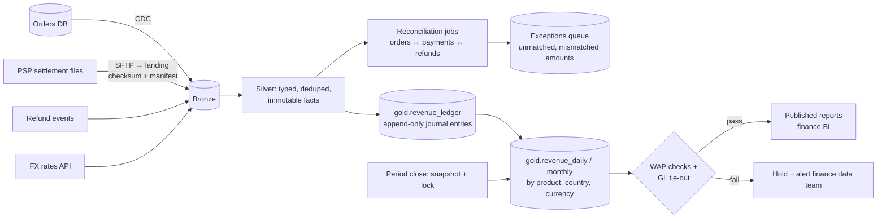
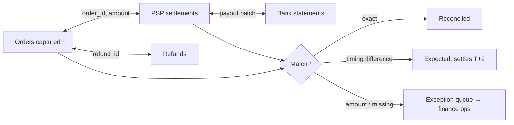

# Design an Auditable Financial Reporting Pipeline

## Problem

Finance needs daily and monthly revenue reporting (gross, refunds, net, by product, country, currency) built from the order system, payment provider files and the refund service. Numbers must match the general ledger, be reproducible months later ("why did March revenue change?") and satisfy auditors (SOX).

---

## Clarifying questions

| Question | Assumed answer |
|---|---|
| Volume? | 5 M orders/day, 30 currencies |
| Sources? | Orders DB (CDC), payment provider settlement files (daily CSV via SFTP), refunds service events, FX rates API |
| Close process? | Month closes on business day 3; after close, numbers are frozen; corrections go to the next period |
| Precision? | Exact to the cent in original and reporting currency |
| Audit? | Every reported number traceable to source records; changes require approval |

## 1. Architecture

## 2. Deep dives

### 2.1 Model revenue as an append-only ledger

Instead of updating "order revenue" in place, record **journal entries**: every business event produces immutable rows.

| entry_id | order_id | event | amount_minor | currency | fx_rate | amount_eur_minor | effective_date | posted_period |
|---|---|---|---|---|---|---|---|---|
| e1 | o42 | capture | 10000 | USD | 0.92 | 9200 | 2026-03-30 | 2026-03 |
| e2 | o42 | refund | -2500 | USD | 0.93 | -2325 | 2026-04-02 | 2026-04 |
| e3 | o42 | correction | -100 | USD | 0.92 | -92 | 2026-03-30 | **2026-04** (March closed) |

- Corrections after close are **new entries in the open period**, never edits to closed periods.
- Any report = `SUM(...) GROUP BY ...` over entries → fully traceable to source events.
- Amounts in **integer minor units** + currency; FX rate stored per entry (rate as of the agreed timestamp), never recomputed later.

### 2.2 Idempotency and reproducibility

- Every entry has a deterministic id (`hash(source, source_id, event_type, version)`) → re-runs never duplicate.
- Pipelines are parameterised by business date; `INSERT OVERWRITE` / `MERGE` by deterministic ids.
- **Period close** creates a snapshot (Delta table version tagged/cloned: `revenue_monthly_2026_03_final`) that never changes. Time travel alone isn't enough (VACUUM); use explicit snapshots or deep clones.

### 2.3 Three-way reconciliation

Match rates and ageing of open exceptions are KPIs; reports show reconciled vs unreconciled amounts.

### 2.4 SOX controls in the data platform

- Change management: code review, CI, approvals; no direct prod edits; deployment logs.
- Segregation of duties: developers can't approve their own production releases or change prod data by hand.
- Access: finance gold tables read-only to most; write only by service principals.
- Evidence: pipeline run logs, DQ results, reconciliation results retained and queryable.
- Data lineage from report cell → ledger entries → source records.

### 2.5 Quality gates before publishing

Totals tie to the GL (tolerance 0); no duplicate entry ids; every order with capture has a ledger entry; FX rates present for all currencies/dates; day-over-day anomaly checks. Failures **block publishing**.

## 3. Trade-offs

| Decision | Choice | Alternative |
|---|---|---|
| Modelling | Append-only ledger | Mutable order facts (simpler, not auditable) |
| Late corrections | Post to current open period | Restate closed periods (breaks audit) |
| FX | Stored rate per entry | Recompute with latest rates (non-reproducible) |
| Processing | Batch (daily) | Streaming (no requirement; harder to control) |

## 4. What separates a senior answer

- **Ledger thinking**: immutable entries, corrections as new entries, closed periods.
- Money in **integer minor units**, FX stored not recomputed.
- **Reconciliation** as a first-class pipeline with exception workflows.
- **SOX controls** expressed as platform features.
- Reproducibility via **explicit snapshots**.

## 5. Follow-up questions

Finance asks why February revenue changed between two report runs.

If February was still open: diff the two report versions (Delta versions/snapshots), trace the delta to new ledger entries (late refunds, corrections) by posted_at. If February was closed, it shouldn't change, and if it did, that's a control failure: investigate who/what wrote to a locked period and add a guard (writes to closed periods rejected by the pipeline).

How do you handle partial refunds and multi-currency orders?

Each refund is its own entry with its own amount, currency and FX rate at refund time (per policy), linked to the original order; net revenue = captures + refunds (negative). Multi-currency orders split into lines per currency. Reporting currency conversions use the stored rates; FX gains/losses are a finance concept that may need separate entries.

---

## Self-assessment rubric

- [ ] Append-only ledger model with deterministic ids
- [ ] Integer money, stored FX rates
- [ ] Period close, snapshots, corrections policy
- [ ] Reconciliation design and exception handling
- [ ] SOX controls and lineage
- [ ] Blocking quality gates and GL tie-out
