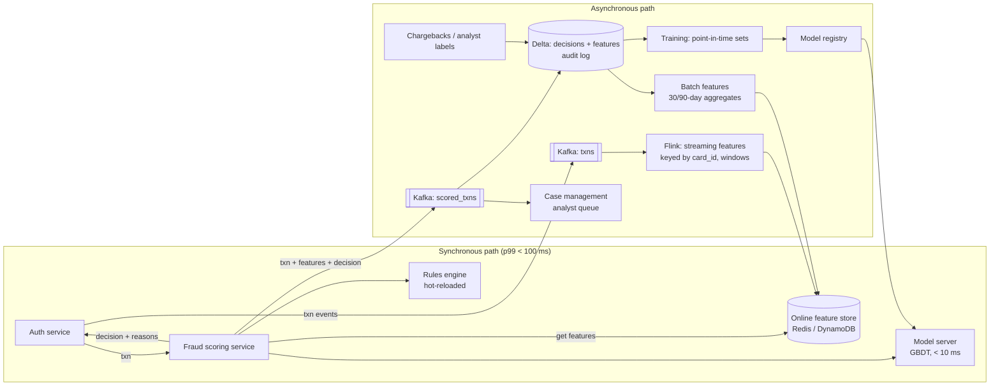
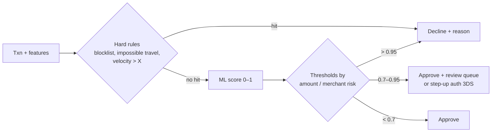

# Design a Real-Time Payment Fraud Detection Pipeline

## Problem

A payment processor handles card transactions. Before authorising, it must decide **approve / review / decline** within the authorisation latency budget. Design the data system that provides real-time features, runs rules and an ML model, alerts analysts, and builds training data.

---

## Clarifying questions

| Question | Assumed answer |
|---|---|
| Throughput? | 10k TPS average, 50k TPS peak |
| Latency budget for the fraud decision? | **p99 < 100 ms** (synchronous, in the auth path) |
| Fail open or closed if fraud service is down? | Fail open for low amounts, rules-only fallback for high amounts |
| Labels? | Chargebacks arrive 30–90 days later; analyst decisions within hours |
| Retention? | 7 years (compliance) |
| Explainability? | Required: reason codes for declines |

## 1. Requirements

- **Online:** score each transaction synchronously; features like "transactions in the last 10 minutes for this card", "distinct merchants in 24h", "distance from last transaction".
- **Offline:** full audit trail of features + decision per transaction; point-in-time correct training sets; model and rule versioning.
- **Ops:** analysts review queue; rules updated without deploys; model rollout via shadow mode.

## 2. Estimates

```
Peak 50k TPS × 1 KB = 50 MB/s into Kafka → 64–128 partitions keyed by card_id
Feature lookups: ~30 features per txn → 1.5M KV reads/s at peak → Redis cluster / DynamoDB (sharded)
Feature state: 500M active cards × ~200 B of counters ≈ 100 GB → fits in a Redis cluster
History: 10k × 86,400 ≈ 0.9B txns/day × 2 KB (txn + features + decision) ≈ 1.8 TB/day raw → ~300 GB/day Parquet → 7 yrs ≈ 750 TB (tiered storage)
```

## 3. Architecture

The key insight: **separate the synchronous scoring path from asynchronous feature computation.**



## 4. Data model

| Table / store | Grain | Notes |
|---|---|---|
| `txns` topic | 1 per transaction | key = card_id |
| Online store | key = `card:{id}`, `merchant:{id}`, `device:{fp}` | latest feature values, TTL |
| `silver.scored_txns` | 1 per txn | txn fields, **feature vector used**, model version, rule hits, score, decision, latency |
| `silver.labels` | 1 per txn label event | source (chargeback/analyst), label_ts |
| `gold.training_set` | txn × label | point-in-time features + label, snapshot per model version |

**Logging the exact feature values used at decision time** is critical: it makes training data point-in-time correct by construction, and it's your audit trail ("why was this declined?").

## 5. Deep dives

### 5.1 Real-time features in Flink

```java
txns.keyBy(t -> t.cardId)
    .process(new KeyedProcessFunction<String, Txn, FeatureUpdate>() {
        // state: ring buffer of last N txns (ts, amount, merchant, geo) with 24h TTL
        // on each txn: update counts for 1m/10m/1h/24h windows, distinct merchants (HLL),
        // last location; emit updated feature row → sink to Redis
    });
```

- Sliding counts via **bucketed counters** (e.g. per-minute buckets summed over the window) instead of storing every event.
- **Race condition:** the scoring service reads features *before* the current transaction updates them. That's correct ("features as of before this txn"). The scoring service can add the current txn to the counts itself.
- **Freshness SLA** for streaming features: < 1–2 s. Monitor end-to-end feature lag; if lag is high, rules relying on velocity degrade → alert.

### 5.2 Scoring service latency budget

```
network in/out          10 ms
feature fetch (batched MGET, parallel stores)  10 ms p99
rules evaluation         2 ms
model inference (GBDT, ~200 trees, local in-process)  5 ms
decision + logging (async to Kafka)  2 ms
headroom                ~70 ms
```

- Batch all feature lookups into one or two round trips; co-locate the scoring service with the feature store (same AZ).
- **Timeouts with defaults:** if a feature store call exceeds 20 ms, use default/fallback values and flag `degraded=true` in the log.
- Model loaded in-process (or on a sidecar), not a remote call over WAN.

### 5.3 Rules engine + ML combination



Rules stored as versioned config (DSL/JSON), hot-reloaded, every rule hit logged with rule version, so analysts can ship a rule for a new fraud pattern in minutes without retraining.

### 5.4 Training data and labels

- Labels are **delayed** (chargebacks up to 90 days) → training sets only include transactions whose label window has closed, or use label maturity weighting.
- **Point-in-time correctness:** use the logged feature vectors (exactly what the model saw), or AS-OF joins against feature history. Never join "current" features to old transactions (leakage).
- **Selection bias:** declined transactions never get chargeback labels → keep a small randomised holdout (approve a tiny % of medium-risk) or use analyst labels.
- Model rollout: offline eval → **shadow mode** (score but don't act, compare) → canary → full. Champion/challenger tracked in the scored_txns table (model_version column).

## 6. Trade-offs

| Decision | Choice | Why / cost |
|---|---|---|
| Stream engine for features | Flink | ms latency, rich keyed state + timers; Spark SS micro-batch adds seconds of feature lag |
| Online store | Redis cluster (or DynamoDB) | sub-ms reads; cost of memory; DynamoDB if you want zero ops and multi-region |
| Model type | Gradient boosted trees | Fast CPU inference, strong on tabular, explainable (SHAP reason codes) |
| Sync vs async scoring | Sync for decision, async for enrichment | Latency budget; async deep-model scoring can trigger post-auth review |
| Fail-open vs closed | Tiered by amount | Business trade-off: lost revenue vs fraud loss. Make it explicit and configurable |

## 7. Failure modes

| Failure | Impact | Mitigation |
|---|---|---|
| Feature store slow/down | Latency breach | Timeouts → defaults; rules-only mode; multi-AZ replicas |
| Flink lag | Stale velocity features → fraud slips | Lag alerting; rules on server-side counts in scoring service as backup |
| Model server bad deploy | Mass declines | Shadow + canary, automatic rollback on decline-rate anomaly |
| Kafka unavailable for logging | Missing audit trail | Local buffer/outbox in scoring service; never block auth on logging |
| Fraud pattern shift | Model drift | Monitor score distribution, decline rate, chargeback rate by segment; retrain cadence |

## 8. Scaling 10×

Shard feature store by card_id; regional deployments (data residency + latency) with per-region Kafka/Flink; precompute merchant/device features in batch; GPU or optimized model runtimes only if model complexity grows.

## 9. What separates a senior answer

- Separates the **sync scoring path** from **async feature computation**, with a latency budget breakdown.
- Logs **features used at decision time** → point-in-time correct training + audit.
- Knows about **delayed labels** and **selection bias**.
- Makes **fail-open vs fail-closed** an explicit business decision.
- Rules + ML layering, with analysts able to ship rules fast.

## 10. Follow-up questions

<details><summary>How do you detect "impossible travel"?</summary>

Online store keeps last transaction location + timestamp per card. On a new txn: distance (haversine) / time delta > ~900 km/h → flag. Edge cases: card-not-present transactions (merchant location ≠ cardholder), VPNs, airports; so feed it as a feature/rule with moderate weight, not an automatic decline.
</details>

<details><summary>How do you backfill a new feature for training?</summary>

Compute it historically in batch from the transaction history with AS-OF semantics (only data before each txn timestamp, e.g. with window functions `RANGE BETWEEN INTERVAL 24 HOURS PRECEDING AND 1 MICROSECOND PRECEDING`). Validate that the batch definition matches the streaming one on a recent overlap period (parity check) before training on it.
</details>

<details><summary>Multi-region active-active: what's hard?</summary>

Card velocity features need a global view, but a card is usually used in one region at a time. Route by card home region or replicate feature updates cross-region asynchronously and accept slight staleness; decide consistency per feature. Kafka cluster linking for logs; lake per region with residency rules.
</details>

---

## Self-assessment rubric

- [ ] Stated a latency budget and separated sync/async paths
- [ ] Defined concrete real-time features and how they're computed (windows, state)
- [ ] Chose an online store and justified it
- [ ] Rules + ML combination with thresholds and reason codes
- [ ] Logged features at decision time for audit/training
- [ ] Addressed delayed labels, leakage, selection bias
- [ ] Model rollout (shadow, canary, rollback)
- [ ] Failure handling: timeouts, defaults, fail-open/closed
- [ ] Capacity estimate for TPS, feature reads, storage
