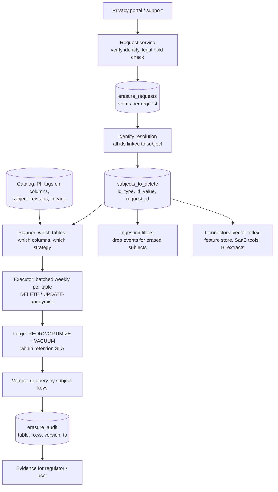
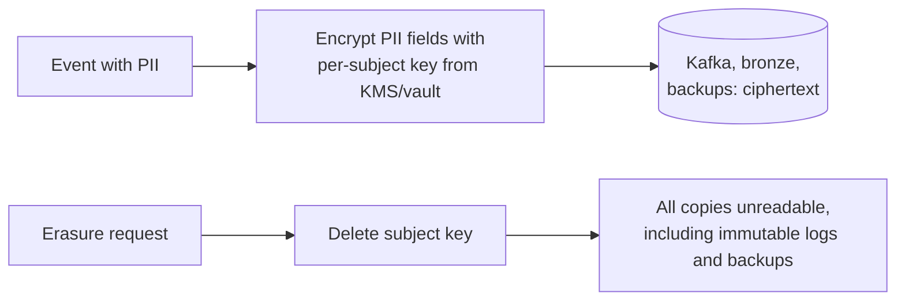

# Design a GDPR Right-to-Erasure Platform for a Lakehouse

## Problem

Users can request deletion of their personal data. The company's lakehouse has ~1,500 tables across 8 domains (bronze/silver/gold), Kafka topics with 7–30 day retention, ML feature tables, a vector index for a support chatbot, BI extracts and backups. Design a system that completes erasure **within 30 days** and can **prove** it to auditors.

---

## Clarifying questions

| Question | Assumed answer |
|---|---|
| Request volume? | ~20k requests/month |
| Identifiers? | customer_id, email, device ids, phone; linked through an identity graph |
| Delete or anonymise? | Delete personal data; aggregates/anonymised statistics may remain; legally required records (invoices, 10 years) retained with restricted access |
| Backups? | Deleted when they expire; must not be restored without re-applying deletions |
| Who owns tables? | Domain teams; platform team owns the deletion framework |

## 1. Requirements

- Intake → identity resolution → discovery of every location → deletion/anonymisation → verification → audit evidence.
- Handle **legal holds** and retention exceptions.
- Low cost: deletions shouldn't rewrite 200 TB daily.
- Self-serve for domain teams: tag your tables correctly and the framework handles them.

## 2. Architecture



## 3. Deep dives

### 3.1 Discovery via catalog tags (not tribal knowledge)

- Every column holding a subject identifier is tagged, e.g. `subject_key = customer_id` / `email`; every PII column tagged `pii`.
- Automated **PII scanners** suggest tags on new columns; CI blocks gold tables without classification.
- The planner queries the catalog: all tables with a `subject_key` tag → delete rows; tables with `pii` columns but only an indirect link → anonymise columns via joins.
- **Lineage** finds derived copies (a CSV export, a notebook-created table) that lack tags → flagged to owners.

### 3.2 Strategy per table type

| Table type | Strategy |
|---|---|
| Silver entity tables (customers) | `DELETE WHERE customer_id IN (subjects)` |
| Fact tables needed for financial totals | Anonymise: set `customer_id = 'ERASED'`, null PII, keep amounts |
| Bronze raw (JSON blobs) | Delete rows by key; for blobs where the key isn't extractable: crypto-shredding or short retention |
| Aggregated gold (no PII) | Nothing |
| Legal retention (invoices) | Move to restricted vault table, delete after retention |
| ML feature store / embeddings / vector index | Delete keys; retrain cadence ensures models don't need deleted data (or document model-level policy) |
| Kafka | Retention ≤ 30 days, or crypto-shredding per subject |

### 3.3 Making deletes cheap in Delta

```sql
-- weekly batch per table, not per request
DELETE FROM silver.orders
WHERE customer_id IN (SELECT id_value FROM privacy.subjects_to_delete
                      WHERE id_type = 'customer_id' AND batch_id = :batch);
-- with deletion vectors this marks rows as deleted (fast); physical removal:
REORG TABLE silver.orders APPLY (PURGE);       -- rewrite files containing deleted rows
VACUUM silver.orders RETAIN 168 HOURS;          -- old versions gone after 7 days
```

Timeline must fit in 30 days: weekly batch (≤ 7 d) + purge + VACUUM retention (7 d) + buffer. **Time-travel retention > 30 days would violate the SLA**, so set `delta.deletedFileRetentionDuration` accordingly.

Clustering big tables by subject key (or including it in liquid clustering keys) limits the number of files rewritten.

### 3.4 Crypto-shredding



Useful where rewriting isn't possible (Kafka logs, backups, append-only archives). Cost: key management at scale (millions of keys), decryption overhead for consumers, and analysts can't join on encrypted values (use a separate pseudonymous key).

### 3.5 Preventing resurrection

- **Ingestion filters**: streams and batch loads drop records for erased subjects (late events from mobile, CDC replays, backfills).
- Backfills/restores from backups must **re-apply** the erasure log before publishing.
- Source systems must delete too (or the next CDC snapshot re-imports the subject).

### 3.6 Verification and audit

For each request: list of tables touched, rows deleted/anonymised, Delta versions, purge/VACUUM timestamps, verifier query results (0 rows found), completion date. Stored immutably; report generated on demand.

## 4. Trade-offs

| Decision | Choice | Alternative |
|---|---|---|
| Batch frequency | Weekly | Per request (file rewrite storm), monthly (SLA risk) |
| Bronze handling | Short retention + crypto-shredding for blobs | Full rewrite of raw JSON (expensive, error-prone) |
| Facts | Anonymise | Delete (breaks financial totals) |
| Discovery | Catalog tags + scanners + lineage | Manual table lists (rot quickly) |

## 5. What separates a senior answer

- **Batching** and understanding of time travel/VACUUM vs the legal SLA.
- **Catalog-driven discovery** with tags, scanners, lineage.
- **Resurrection prevention** (late data, backfills, restores, sources).
- **Crypto-shredding** for immutable stores.
- Audit evidence and legal holds.

## 6. Follow-up questions

<details><summary>A data scientist copied customer data into a personal schema last year. How does your system catch it?</summary>

PII scanner runs across all schemas (not just governed ones); lineage shows the table derived from silver.customers; untagged tables with detected PII are flagged and either auto-tagged (then included in erasure) or blocked. Policy: personal schemas have TTLs and can't hold PII without approval.
</details>

<details><summary>What about the trained ML model: does it need to "forget"?</summary>

Usually the documented policy is: deleted data is excluded from future training runs, and models are retrained on a regular cadence, so influence fades within a bounded time. Machine unlearning research exists, but regular retraining is the practical answer. Vector indexes and feature stores, however, must delete immediately because they return the data directly.
</details>

---

## Self-assessment rubric

- [ ] Request lifecycle with identity resolution and legal holds
- [ ] Catalog/tag-driven discovery + PII scanning + lineage
- [ ] Per-table strategy (delete vs anonymise vs retain)
- [ ] Delta physical deletion: deletion vectors, purge, VACUUM vs SLA
- [ ] Crypto-shredding for Kafka/backups
- [ ] Resurrection prevention
- [ ] Verification + audit evidence
