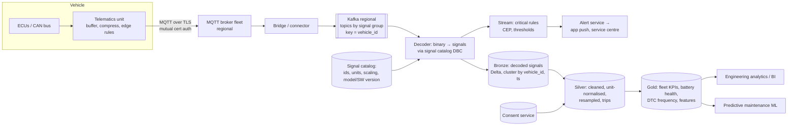
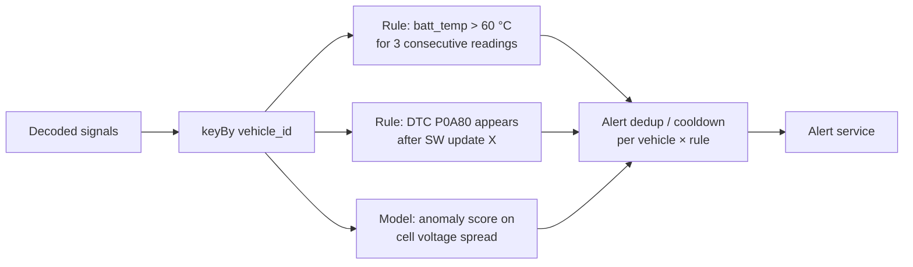

# Design a Connected-Vehicle Telemetry Platform

## Problem

A car manufacturer has 5 million connected vehicles. Each vehicle sends sensor signals (speed, battery state, temperatures, GPS, error codes). The company wants:
1. **Near-real-time fault detection** (e.g. battery overheating) → alert the driver/service centre within a minute.
2. **Fleet analytics** for engineering (battery degradation by model/climate, error-code frequency after software updates).
3. **ML training data** (predictive maintenance).
4. Compliance with **GDPR** (location is personal data) and regional data residency.

---

## Clarifying questions

| Question | Assumed answer |
|---|---|
| Signals & frequency? | ~200 signals; most sampled at 1 Hz on the car, uploaded in batches every 10–60 s; error codes event-driven |
| Connected at once? | ~2 M vehicles at peak |
| Connectivity? | Intermittent (tunnels, garages), so data can arrive hours/days late |
| Real-time needs? | Only for a defined set of critical signals |
| Consent? | Location/driving behaviour only with driver consent; varies per market |

## 1. Estimates

```
Naive: 2M connected cars × 200 signals × 1 Hz = 400M values/s, far too much to ship raw.
With edge filtering (send-on-change, priorities): ~50 values/s per car.
Per upload every 30 s: 30 s × 50 values × ~4 B (delta-encoded, compressed) ≈ 6 KB
2M cars / 30 s ≈ 67k uploads/s × 6 KB ≈ 400 MB/s compressed ingest
  → large: Kafka 512+ partitions, split into regional clusters
Storage: 400 MB/s × 86,400 ≈ 35 TB/day compressed at peak rates → retain raw high-res 30–90 days, downsample for long-term
```

The numbers force **edge processing** (send changes/deltas, not every sample) and **tiered retention**. Say this out loud.

## 2. Architecture



## 3. Deep dives

### 3.1 Ingestion protocol

- **MQTT** (lightweight, pub/sub, QoS levels, persistent sessions) from vehicle to a broker fleet; bridge to Kafka for durable processing. Don't let millions of devices connect to Kafka directly.
- Device identity via **X.509 certificates**, topic ACLs per vehicle (`vehicles/{vin}/telemetry`).
- Vehicle buffers when offline and uploads with original timestamps → late data is normal.
- **Edge processing**: send-on-change with deadband (only send battery temp if it changes by > 0.5°C), local aggregation, priority channel for critical events.

### 3.2 Decoding with a signal catalog

Raw payloads are binary frames (CAN signal ids, scaling factors). A **versioned signal catalog** (per model and software version) maps ids → name, unit, scale, offset. The decoder joins against the catalog (broadcast/cached). Wrong catalog version = garbage data, so catalog version is stored with each row.

### 3.3 Time-series data layout

Long/narrow vs wide format:

| Format | Example | Pros | Cons |
|---|---|---|---|
| Narrow (EAV) | `vehicle_id, ts, signal_name, value` | Any signal, schema-stable | Huge row counts, pivot for analysis |
| Wide | `vehicle_id, ts, speed, soc, batt_temp, ...` | Easy analytics, compresses well | Sparse, schema changes with new signals |
| Hybrid | Narrow in bronze, wide per signal group in silver (resampled to 1 s / 10 s) | Best of both | Extra step |

Clustering by `(vehicle_id, ts)` or `(signal_group, date)` depending on dominant queries (single vehicle diagnostics vs fleet-wide analysis); often keep both layouts in silver for the two access patterns.

**Downsampling** for long retention: 1 Hz raw for 30–90 days → 1-min aggregates (min/max/avg/last) forever.

### 3.4 Real-time fault detection



- Keyed stateful processing per vehicle (Flink CEP or Spark `transformWithState`).
- **Cooldown/dedup** to avoid alert storms; **event-time** semantics because of buffered uploads (a 3-hour-old overheating event is still worth logging, but maybe not worth a push notification).
- Rules versioned and configurable by engineers without redeploys.

### 3.5 Privacy and residency

- Separate **identity** (VIN ↔ owner) from **telemetry** (pseudonymous vehicle key); only a few services can join them.
- **Consent-aware processing:** location and driving-behaviour signals only flow to silver when consent is active (consent service lookup, effective-dated); revocation triggers deletion.
- **Regional processing** (EU data in EU, China in China), with only aggregated, anonymised data crossing borders.
- Location precision reduction (coarsen GPS) for analytics that don't need exact positions.

## 4. Trade-offs

| Decision | Choice | Alternative |
|---|---|---|
| Device protocol | MQTT → Kafka bridge | HTTPS batches (simpler, less efficient), AWS IoT Core / Azure IoT Hub (managed) |
| Storage | Delta lakehouse + downsampling | Time-series DB (InfluxDB, TimescaleDB): great for recent per-device queries, not for petabyte fleet analytics; often used *alongside* for the live vehicle view |
| Real-time scope | Only critical signals | Everything real-time (cost explodes, no business need) |
| Format | Narrow bronze + wide silver | Single format for all |

## 5. Failure modes

| Failure | Handling |
|---|---|
| Fleet-wide reconnect after outage (thundering herd) | Randomised backoff in TCU firmware, broker autoscaling, Kafka buffering |
| Wrong signal catalog deployed | Decoded value range checks per signal → quarantine; reprocess from bronze raw payloads |
| Clock drift on vehicle | Server receive time recorded; correct via GPS time; flag implausible timestamps |
| Firmware bug floods error codes | Per-vehicle rate limiting, anomaly alert on DTC volume per SW version |

## 6. What separates a senior answer

- Uses estimates to justify **edge filtering, compression and tiered retention**.
- Knows **MQTT** and device identity, and doesn't connect devices to Kafka.
- **Signal catalog versioning**: the real-world source of data corruption.
- Time-series layout choices and downsampling.
- **Privacy by design**: pseudonymisation, consent, residency.

## 7. Follow-up questions

<details><summary>Engineering asks: "did error code X increase after software update 24.3?" How do you support that?</summary>

Gold table of DTC events joined with an SCD2 table of vehicle software versions (effective-dated from OTA update logs): rate of DTC X per 1,000 vehicles per day, before vs after the update, controlling for model/region/age. The SCD2 join (point-in-time software version) is the key modelling element.
</details>

<details><summary>How do you build training data for predictive maintenance?</summary>

Labels from service/warranty records (component replaced on date D). Features from telemetry windows before D (e.g. 30 days of downsampled signals), point-in-time correct. Negative examples from vehicles without failure at comparable mileage/age. Class imbalance handled; strict time-based train/test split.
</details>

---

## Self-assessment rubric

- [ ] Realistic volume math leading to edge filtering and tiered storage
- [ ] Device protocol + identity/security
- [ ] Decoding with versioned signal catalog
- [ ] Time-series layout and downsampling strategy
- [ ] Real-time rules with keyed state, dedup/cooldown, event time
- [ ] Late/offline data handling
- [ ] Privacy: pseudonymisation, consent, residency
