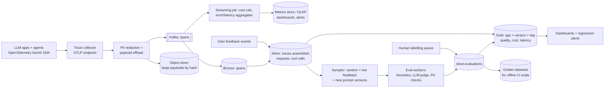
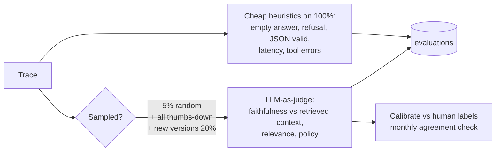

# Design an LLM Observability and Evaluation Data Platform

## Problem

A company runs 40 internal and customer-facing LLM applications (chatbots, RAG assistants, agents that call tools). Leadership asks: *What do we spend per app? Which apps got worse after last week's model or prompt change? Where are users unhappy?* Design the platform that captures, stores and analyses LLM traces and evaluations.

---

## Clarifying questions

| Question | Assumed answer |
|---|---|
| Volume? | 20 M LLM calls/day; agents produce 5–30 spans per task |
| Payload sizes? | Prompts/completions average 6 KB, up to 200 KB |
| Privacy? | Prompts may contain PII/customer data; retention 30 days for raw text, metrics forever |
| Real-time needs? | Cost/error dashboards within minutes; quality evals can lag hours |
| Eval methods? | Heuristics, LLM-as-judge, human labels, user feedback |

## 1. Estimates

```
20M calls × ~3 spans avg = 60M spans/day ≈ 700/s avg, ~3k/s peak
Raw payload: 20M × 6 KB ≈ 120 GB/day (compresses ~4–5×) → 30-day raw retention ≈ 1 TB compressed
Metrics rows (no text): 60M × 300 B = 18 GB/day → keep forever
LLM-as-judge on 100% of traffic would cost as much as the apps themselves → sample (e.g. 5%) + target low-feedback traces
```

## 2. Architecture



## 3. Data model

```sql
silver.spans (trace_id, span_id, parent_span_id, app, env, span_kind,  -- llm | retrieval | tool | agent_step
              model, prompt_version, start_ts, end_ts, latency_ms,
              input_tokens, output_tokens, cached_tokens, cost_usd,
              status, error_type, payload_ref, user_hash, session_id)
silver.traces  (trace_id, app, root latency, total cost, n_llm_calls, n_tool_calls, outcome, feedback)
silver.evaluations (trace_id, evaluator, evaluator_version, metric, score, rationale_ref, ts)
gold.app_daily (app, date, prompt_version, model, requests, p50/p95 latency, cost, error_rate,
                faithfulness_avg, thumbs_down_rate, eval_sample_size)
```

## 4. Deep dives

### 4.1 Instrumentation and trace assembly

- Standardise on **OpenTelemetry** semantic conventions for GenAI (model, tokens, operation) so all 40 apps emit the same schema; SDK wrappers make adoption a one-line change.
- Spans arrive out of order; assemble traces in silver with a watermark (e.g. complete when root span ended + 10 min).
- Large payloads are stored once in object storage keyed by content hash (dedup of repeated system prompts); spans carry a reference.

### 4.2 Cost attribution

Price table (model, token type, effective date) as an SCD2 dimension → `cost = input × price_in + output × price_out − cached discounts`, computed in streaming for live dashboards and recomputed in batch (prices change, corrections). Tag by app/team/customer for chargeback.

### 4.3 Evaluation pipeline



- Judges are versioned (prompt + model); scores are only comparable within a judge version.
- **Regression detection:** compare quality/cost/latency per app between prompt/model versions with confidence intervals (sample sizes matter) → alert on significant drops.
- Feed failures into **golden datasets** used in offline CI evaluation before deployment.

### 4.4 Privacy

Redaction at the collector (PII detectors) before data lands; raw text retained 30 days with restricted access; metrics and evaluations (no raw text) kept long-term; customer-facing apps can opt out of payload capture entirely (metadata only).

## 5. Trade-offs

| Decision | Choice | Alternative |
|---|---|---|
| Storage | Lakehouse (Delta) for analytics + OLAP/metrics store for live dashboards | Vendor tool (LangSmith, Langfuse, Arize): fast start; build when you need cross-app analytics and governance |
| Eval coverage | Heuristics on all + sampled judges | Judge everything (cost explodes) |
| Payloads | Offloaded by hash | Inline in spans (bloat, harder to purge) |

## 6. What separates a senior answer

- **Standard schema** (OTel) across apps, trace assembly with out-of-order handling.
- Cost computed from an **effective-dated price dimension**.
- **Sampling strategy** for expensive evals; judge calibration and versioning.
- Statistically sound regression detection.
- Privacy: redaction, retention split between raw text and metrics.

## 7. Follow-up questions

<details><summary>An agent's average cost doubled this week. How do you find out why?</summary>

Drill down in gold/silver: by app version, model, prompt_version, span_kind. Look at tokens per trace and LLM calls per trace (agent loops increasing?), cache hit rate drop, longer retrieved context, retry storms on tool errors. Trace-level examples of the most expensive tasks usually reveal the loop or prompt bloat.
</details>

<details><summary>How do you know your LLM judge is trustworthy?</summary>

Measure agreement with human labels on a stratified sample (Cohen's kappa / correlation), check for biases (length, position, self-preference), version and freeze judge prompts, re-calibrate when the judge model changes, and use pairwise comparisons for A/B decisions.
</details>

---

## Self-assessment rubric

- [ ] Instrumentation standard and trace data model
- [ ] Volume and cost estimates incl. eval cost
- [ ] Streaming metrics + batch analytics split
- [ ] Cost attribution with price history
- [ ] Eval pipeline with sampling, judge versioning, human calibration
- [ ] Regression detection across versions
- [ ] PII redaction and retention
