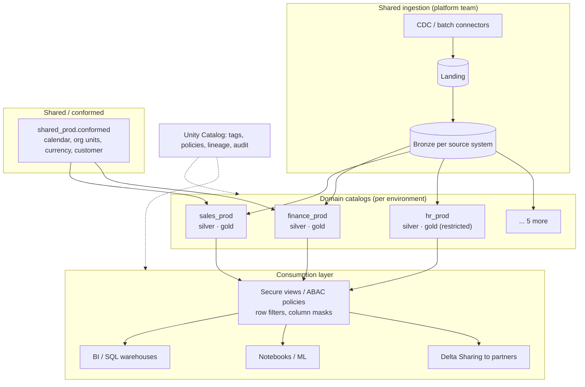
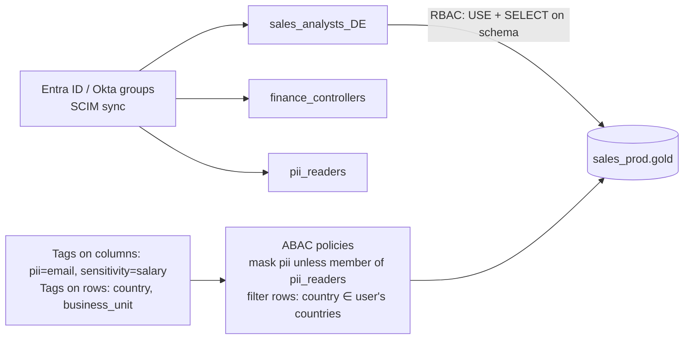
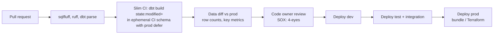

# Design a Governed Enterprise Lakehouse for 8 Business Domains

## Problem

A large enterprise is consolidating data from legacy warehouses and dozens of source systems into one lakehouse. Eight business domains (sales, after-sales, finance, HR, manufacturing, logistics, procurement, marketing) will build their own data products. 1,000+ users across countries need access with strict controls (GDPR, SOX, works-council rules for HR data). Design the platform.

---

## Clarifying questions

| Question | Assumed answer |
|---|---|
| Platform? | Databricks on Azure (answer stays vendor-neutral where possible) |
| Team structure? | Central platform team (~8 engineers) + domain data teams (2–10 each) |
| Users? | Analysts (SQL/BI), data scientists, engineers, external auditors (read-only) |
| Regulatory? | GDPR, SOX for finance, regional residency for some countries |
| Legacy? | Exasol/Oracle warehouses to be migrated over 18 months |

## 1. Requirements

- Clear **ownership** and **isolation** per domain, with governed sharing of data products.
- **Fine-grained access**: row-level (country/business unit), column-level (PII, salaries), by persona.
- **Standardised transformations** (dbt) with reusable logic; CI/CD with environments.
- Auditability (who accessed what), lineage, data quality.
- Cost transparency per domain.

## 2. Architecture



## 3. Deep dives

### 3.1 Catalog & environment layout

```
<domain>_<env>.<layer>.<object>
sales_dev.silver.orders · sales_prod.gold.fct_orders · shared_prod.conformed.dim_calendar
```

- Catalog per domain per environment → isolation, separate storage locations (managed by the platform), clear ownership.
- Bronze owned by the platform team (one copy per source system, reused by many domains).
- Cross-domain consumption only through **published gold data products** (with contracts), never another domain's silver.

### 3.2 Access model: RBAC + ABAC



- **RBAC** for coarse grants at catalog/schema level (domain membership).
- **ABAC** via governed tags + central policies for masking and row filtering → new tables are protected automatically when tagged; scales across 1,000+ users and thousands of tables.
- **Service principals** per pipeline; no human write access to prod.
- Access requests through a workflow (owner approval, expiry); quarterly recertification.

### 3.3 A dedicated privacy layer

For GDPR-heavy domains, add an explicit layer between silver and gold whose contract is **"no direct identifiers past this point"**: pseudonymised keys, consent-filtered records, generalised attributes. Gold and BI consume only this layer; a handful of approved processes can re-identify.

### 3.4 Shared transformation standards

- **dbt project template** per domain; a shared **macro package** maintained by the platform team: surrogate keys, audit columns, PII masking, ghost/unknown-member records for dimensions, SCD helpers, generic DQ tests.
- Conventions: naming (`stg_`, `int_`, `dim_`, `fct_`), model contracts on public gold models, required tests on keys, docs on every gold column.
- Result: 8 domains share one way of doing surrogate keys, SCD2 and masking instead of 8 slightly different ones.

### 3.5 CI/CD



Infrastructure as code (Terraform / Asset Bundles) for catalogs, schemas, grants, jobs, clusters. SOX: segregation of duties, approvals, change log.

### 3.6 Cost and operations

- Compute per domain (SQL warehouses, job clusters) tagged for chargeback; budgets and alerts.
- Serverless/auto-stop warehouses; job clusters over all-purpose clusters; spot workers.
- Predictive optimization / scheduled OPTIMIZE + VACUUM; liquid clustering defaults.
- Platform SLOs: ingestion freshness per source, platform availability.

## 4. Trade-offs

| Decision | Choice | Alternative |
|---|---|---|
| Isolation | Catalog per domain per env | Schema per domain in one catalog (simpler, weaker isolation) |
| Access control | RBAC + tag-based ABAC | Hundreds of dynamic views (unmaintainable) |
| Ownership model | Federated (domains own silver/gold), central platform & conformed dims | Fully central team (bottleneck) / pure mesh (duplication) |
| Bronze | Shared per source | Per domain copies (cost, inconsistency) |

## 5. What separates a senior answer

- Clear **ownership and contracts** between platform, domains and consumers.
- **ABAC with tags** as the scaling answer for fine-grained access.
- **Shared macro/library** strategy so standards are code, not wiki pages.
- **CI/CD with slim CI + data diffs**, SOX controls.
- Thinks about **migration from legacy** and **cost chargeback**.

## 6. Follow-up questions

<details><summary>How do you migrate 2,000 legacy warehouse objects without a big bang?</summary>

Inventory + lineage of the legacy warehouse; prioritise by consumer value; migrate domain by domain, building bronze from the same sources (not from the legacy DWH) where possible; automate SQL translation (transpilers like sqlglot, or LLM-assisted with validation); run legacy and new in parallel with automated reconciliation (row counts, aggregates per key); switch consumers per data product; decommission. See the [warehouse migration problem](/interview-prep/practice/system-design/warehouse-migration/).
</details>

<details><summary>HR data: only HR business partners for their own org units may see salaries. Implement it.</summary>

Tag `salary` columns `sensitivity=restricted`; mask policy reveals only to the `hr_comp_readers` group. Row filter on `org_unit_id` using a mapping table (user → allowed org units, maintained from HR system). Audit all access; works-council-approved purpose documented; no export permissions.
</details>

---

## Self-assessment rubric

- [ ] Catalog/environment layout with ownership boundaries
- [ ] RBAC + ABAC with tags, row filters, column masks
- [ ] Privacy layer / PII minimisation strategy
- [ ] Shared standards as code (dbt template, macro package, contracts)
- [ ] CI/CD with environments, slim CI, SOX controls
- [ ] Data quality, lineage, audit
- [ ] Cost chargeback and operations
