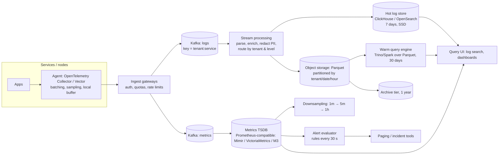

# Design a Logs and Metrics Observability Platform

## Problem

Your company runs 5,000 microservices across three regions. Engineers need to **search logs**, view **metrics dashboards** and receive **alerts** within seconds. Today's vendor bill is exploding. Design an in-house observability data platform for logs and metrics (traces optional), with retention of 30 days searchable and 1 year archived.

---

## Clarifying questions

| Question | Assumed answer |
|---|---|
| Log volume? | 5M lines/s peak, ~500 bytes average → 2.5 GB/s, ~150 TB/day raw |
| Metrics? | 50M samples/s, ~20M active time series (after cardinality controls) |
| Query patterns? | Logs: recent (last 1-24 h) search by service, level, trace_id, free text. Metrics: dashboards over 1 h-30 d, alert rules evaluated every 30 s |
| Retention? | Logs: 7 days hot, 30 days warm, 1 year cold (compliance). Metrics: 15 days raw, 13 months downsampled |
| Latency? | Logs searchable < 30 s after emission; alerts evaluated on data < 60 s old |
| Multi-tenancy? | Teams as tenants with quotas and chargeback |

## 1. Requirements

**Functional:** collect logs and metrics; parse and enrich (service, region, Kubernetes metadata); log search (filters + full text); metrics queries (PromQL-like); alerting; tiered retention and archive; per-team quotas.

**Non-functional:** ingestion must never block applications (drop or sample rather than back up into apps); the alerting path must be more reliable than the platform it monitors; cost per GB well below the vendor's; isolation between tenants.

## 2. Estimates

- Logs: 150 TB/day raw; with ~10× compression in columnar/indexed storage → ~15 TB/day stored. 7 days hot ≈ 105 TB on SSD; 30 days warm ≈ 450 TB on object storage; 1 year cold ≈ 5.5 PB compressed in object storage (archive tier).
- Kafka: 2.5 GB/s ingest × replication 3 → 7.5 GB/s of broker writes; with ~50 MB/s per partition → ~100+ partitions per region for logs; 24 h retention for replay buffer ≈ 650 TB across clusters (or tiered storage).
- Metrics: 50M samples/s × ~1.5 bytes after Gorilla-style compression ≈ 75 MB/s ≈ 6.5 TB/day; 20M series × index overhead fits in a horizontally scaled TSDB.

## 3. Architecture

## 4. Data model

**Logs (columnar):** `timestamp`, `tenant`, `service`, `env`, `region`, `host/pod`, `level`, `trace_id`, `span_id`, `message`, plus a `attributes` map with **promoted columns** for frequently filtered keys (e.g. `http.status`, `user_tier`). Sort/primary key `(tenant, service, timestamp)` for locality; skip indexes (bloom filters, token indexes) on `trace_id` and message tokens.

**Metrics:** a series = metric name + label set (`http_requests_total{service="checkout", status="500", region="eu"}`); samples `(timestamp, value)` compressed per series in blocks (delta-of-delta timestamps, XOR-encoded floats).

## 5. Deep dives

### 5.1 Ingestion that never hurts applications

- Agents batch and compress; they buffer locally (bounded) and **drop by priority** (debug first) when the pipeline is unavailable, never blocking the app.
- Gateways enforce **per-tenant quotas** (bytes/s, series count); excess is sampled or rejected with clear metrics so teams see what they're losing.
- Kafka decouples ingestion from storage: storage outages or slow indexing build lag rather than data loss.

### 5.2 Cost control for logs

- **Tiering:** hot (indexed, SSD, 7 days) → warm (Parquet on object storage, query on demand) → cold archive. Most queries hit the last 24 h.
- **Reduce at the source:** sampling of debug/info logs (keep 100% of errors), dropping health-check noise, structured logging to avoid parsing costs, deduplicating repeated stack traces.
- **Index less:** full-text indexes on everything are the main cost driver; index only promoted fields and use bloom/token skip indexes, relying on brute-force columnar scans for the rest (ClickHouse-style).
- **Chargeback:** per-tenant bytes ingested and stored, visible to teams.

### 5.3 Metrics cardinality

- Cardinality (number of distinct series) is the TSDB's scaling limit: one label like `user_id` or `request_id` can create millions of series.
- Controls: per-tenant **active series limits**; relabeling rules dropping high-cardinality labels at ingest; cardinality dashboards ("top labels by series count"); guidance to put high-cardinality data in logs/traces, not metrics.
- **Downsampling** for long retention: 1-minute raw for 15 days, 5-minute and 1-hour rollups (min/max/sum/count) for 13 months.

### 5.4 Reliable alerting

- Evaluate alerts on a path with **fewer dependencies** than the main query path (dedicated evaluators reading the TSDB's recent data, replicated across zones).
- **Meta-monitoring:** watchdog alerts that fire if the pipeline stops delivering ("no data from region X in 2 minutes"), plus an independent external heartbeat, since the platform can't alert on its own total failure otherwise.
- Alert on symptoms (SLO burn rates) rather than every cause, to reduce noise.

### 5.5 PII and security

- Redaction in the stream processor (emails, tokens, card numbers via patterns and allowlists); restricted tenants for sensitive services; access control per tenant; audit logs for queries over sensitive logs.

### 5.6 Multi-region

- Ingest and store **in-region** (data residency and egress cost); query fan-out across regions from the UI with a global query layer; alerting runs per region.

## 6. Trade-offs

| Decision | Choice | Alternative |
|---|---|---|
| Hot log store | Columnar (ClickHouse) with skip indexes | Inverted-index search (OpenSearch): faster full-text, much higher storage/indexing cost |
| Warm/cold | Parquet on object storage + query engine | Keep everything in the hot store (cost explodes) |
| Metrics store | Prometheus-compatible horizontally scalable TSDB | Logs-as-metrics (expensive queries) |
| Overload behaviour | Sample/drop low-priority data at agents | Backpressure into apps (outages) |
| Alerting | Separate, simpler evaluation path + meta-monitoring | Alerts on the same query cluster as dashboards |

## 7. Failure modes

- **Indexing falls behind during an incident** (log volume spikes 5×, exactly when people need logs): Kafka buffers; autoscale consumers; prioritise error-level and on-call teams' streams; temporarily raise sampling of debug logs.
- **Cardinality explosion from a bad deploy:** series limits reject the new series for that tenant only; the cardinality alert notifies the team.
- **Object storage throttling:** spread prefixes, batch writes into larger files, compaction.
- **Query of death** (unbounded regex over 30 days): query limits, timeouts, per-tenant concurrency, cost estimation before execution.

## 8. What separates a senior answer

- Estimates that drive the design (TB/day, tiers, partitions) and a clear **cost strategy** (tiering, sampling, index less).
- **Cardinality management** as the central metrics problem.
- Protecting applications from the observability pipeline (**drop, don't block**).
- **Meta-monitoring** and an alerting path more reliable than the rest.
- Multi-tenancy with quotas and chargeback.

## 9. Follow-up questions

How do you add distributed tracing without tripling cost?

Tail-based sampling in collectors: keep 100% of traces with errors or high latency and a small percentage of normal ones; store spans in the same columnar store keyed by trace_id with a skip index; link logs and metrics via trace_id/exemplars so engineers can pivot from a metric spike to example traces.

A team wants to keep 1 year of searchable logs for security investigations.

Keep them in the warm/cold Parquet tier with partitioning by tenant/date and bloom filters on IP, user and trace fields; provide an asynchronous query interface (minutes, not seconds) and charge the team for the extra storage and scans. Security events specifically can be routed to a dedicated SIEM table with longer hot retention.

---

## Self-assessment rubric

- [ ] Volume estimates translated into storage tiers, Kafka sizing and TSDB scale
- [ ] Agent buffering, priority dropping, quotas: apps never blocked
- [ ] Tiered log storage (hot indexed → warm Parquet → cold archive)
- [ ] Cost levers: sampling, promoted fields, skip indexes, chargeback
- [ ] Metrics cardinality controls and downsampling
- [ ] Reliable alerting path and meta-monitoring
- [ ] PII redaction, tenant isolation, multi-region design
