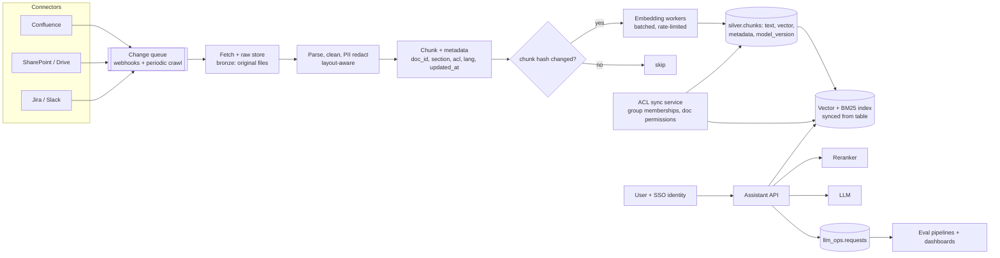
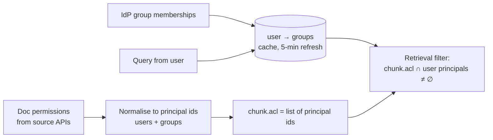

# Design an Enterprise RAG Knowledge Assistant


## Problem

Employees should be able to ask questions in natural language and get answers grounded in internal knowledge: Confluence, SharePoint, Google Drive, Jira, Slack, PDFs. Answers must cite sources and **only use documents the asking user is allowed to see**. Design the system with a focus on the data pipelines.

---

## Clarifying questions

| Question | Assumed answer |
|---|---|
| Corpus size? | 5 M documents, ~50 M chunks; 2% change per day |
| Users / QPS? | 50k employees, peak 50 queries/s |
| Latency? | First token < 2 s, full answer < 8 s |
| Freshness? | Edits visible within 15 minutes; permission changes within 5 minutes |
| Languages? | English + German + Japanese |
| Hosting constraints? | LLM via a cloud provider in-region; no training on company data |

## 1. Estimates

```
Chunks: 50M × 1024-dim float32 (4 KB) = 200 GB vectors → + HNSW overhead ≈ 300 GB RAM
  → int8 quantisation ≈ 75 GB, or sharded index across nodes
Daily changes: 2% × 5M = 100k docs → ~1M chunks re-embedded/day → ~500M tokens/day → tens of $/day
Initial embedding: 50M chunks × 500 tokens = 25B tokens → one-off, hundreds of $; rate limits dominate time (days)
Query: 50 QPS × (retrieve 50 + rerank + LLM ~4k input tokens) → LLM cost dominates: budget per query
```

## 2. Architecture



## 3. Deep dives

### 3.1 Incremental ingestion

- **Change detection:** webhooks where available (near real time), plus periodic crawls (with `modified_since`) and weekly full reconciliation to catch missed events and **deletions**.
- **Bronze keeps the raw file** (re-parse when the parser improves, without re-downloading).
- `chunk_id = hash(doc_id, chunk_index, chunk_text)`: unchanged chunks keep their embeddings; changed docs re-embed only changed chunks; removed chunks are deleted.
- **Embedding workers** pull from a queue, batch requests (e.g. 100 chunks), respect rate limits with token buckets, retry with backoff, DLQ for persistent failures. Idempotent upserts by chunk_id.

### 3.2 Permissions (the make-or-break requirement)



- Store ACLs as metadata on each chunk; **pre-filter** in the vector search (not post-filter: post-filtering top-50 might leave 0 results and leaks timing/side channels).
- Permission changes propagate via ACL sync **without re-embedding** (metadata-only update).
- Group explosion (users in 500 groups): store group ids on chunks, expand user → groups at query time.
- Audit log: which chunks were shown to which user.

### 3.3 Retrieval quality

- **Hybrid search** (BM25 + dense, reciprocal rank fusion): crucial for ticket ids, error codes, product names.
- **Query rewriting:** conversation-aware (resolve "what about for Japan?" using chat history), multilingual (multilingual embeddings or translate query).
- **Rerank** top 50 → top 5–8 with a cross-encoder.
- **Metadata boosts/filters:** recency for fast-changing content, space/project filters, document type.
- **Chunking:** structure-aware for Confluence/Markdown (by headings, keep section path as context), tables kept intact, parent-child retrieval for long docs.

### 3.4 Evaluation & monitoring

| What | How |
|---|---|
| Retrieval recall@k | Golden set: 500 questions with known relevant docs (from SMEs + mined from search logs) |
| Faithfulness / citation correctness | LLM judge + human spot checks weekly |
| Freshness | `now − source.updated_at` for recently edited docs, end-to-end ingestion lag |
| ACL correctness | Synthetic test users with known permissions; automated leakage tests in CI |
| Cost & latency | Per request logs; budget alerts |
| User feedback | 👍/👎 + "wrong source" flags → triage queue → golden set growth |

Every change (chunker, embedding model, prompt, reranker) runs the eval suite before rollout; embedding model changes use **blue/green indexes**.

## 4. Trade-offs

| Decision | Choice | Alternative |
|---|---|---|
| Source of truth | Delta chunks table; index derived | Vector DB as the only store (hard to rebuild/audit) |
| ACL enforcement | Pre-filter in retrieval | Post-filter, or separate index per group (explodes) |
| Embedding model | Multilingual, 768–1024 dims, quantised | Larger dims (cost/RAM), per-language models (complexity) |
| Freshness | Webhooks + crawl + reconcile | Nightly full re-index (stale, costly) |

## 5. Failure modes

| Failure | Handling |
|---|---|
| Embedding API throttled/outage | Queue backlog grows; freshness SLO alert; keep serving existing index |
| Permission sync lag | Fail closed: if ACL data for a doc is older than threshold, exclude it |
| Bad parser release mangles tables | Eval regression catches; re-parse from bronze raw files |
| Prompt injection inside documents | Treat retrieved text as data in the prompt, strip/flag suspicious instructions, restrict tool access |

## 6. What separates a senior answer

- Treats **ingestion as an incremental, idempotent data pipeline** with a rebuildable index.
- **Permission-aware retrieval** with pre-filtering and fast ACL propagation.
- **Evaluation infrastructure** as a first-class component.
- Cost and rate-limit math for embeddings and LLM calls.
- Blue/green index strategy for model changes.

## 7. Follow-up questions

<details><summary>How do you handle questions over structured data ("revenue in Q3 for Germany")?</summary>

RAG over documents is the wrong tool. Route to a text-to-SQL tool over governed gold tables (semantic layer / metric definitions as context, executed with the user's permissions), or to certified dashboards. A router (classifier or the LLM with tools) decides between document search and SQL.
</details>

<details><summary>Users complain the bot answers from outdated pages. Fix it.</summary>

Measure freshness lag; ensure deleted/archived pages are removed (reconciliation crawl); deduplicate near-identical versions; boost recency and prefer canonical/verified spaces; display "last updated" with citations; let owners mark docs as deprecated (metadata filter).
</details>

---

## Self-assessment rubric

- [ ] Sizing of vectors/RAM and embedding/LLM cost
- [ ] Incremental ingestion with hashing, deletes, raw bronze
- [ ] Chunking strategy and metadata
- [ ] Permission model with pre-filtering and fast ACL sync
- [ ] Hybrid retrieval + reranking + query rewriting
- [ ] Evaluation (golden set, faithfulness, ACL tests) and monitoring
- [ ] Blue/green index for model changes
