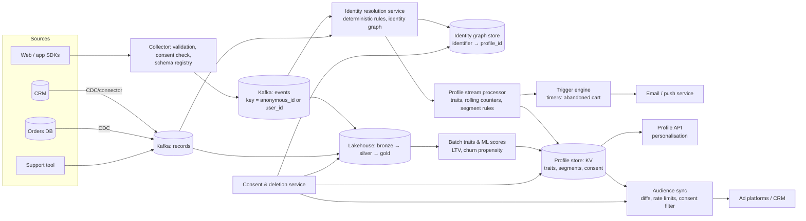

# Design a Real-Time Customer Data Platform

## Problem

Marketing and product teams want a **single, up-to-date profile per customer**: identities across devices, traits (country, lifetime value), recent behaviour and segment memberships. They want to trigger messages within seconds ("abandoned cart after 30 minutes") and sync audiences to ad and email platforms. Data comes from web/app event SDKs, the CRM, the order database and the support tool. Consent and GDPR deletion must be enforced everywhere.

---

## Clarifying questions

| Question | Assumed answer |
|---|---|
| Users? | 150M known + anonymous profiles; 40M monthly active |
| Events? | 2B events/day (page views, product views, cart, purchases) |
| Latency? | Real-time segments and triggers < 10 s; batch traits daily |
| Destinations? | Email/push service, ad platforms (audiences), CRM, in-app personalisation API |
| Identity sources? | Anonymous device IDs, login user IDs, emails, phone numbers, loyalty IDs |
| Consent? | Per purpose (marketing, personalisation, analytics), per region |

## 1. Requirements

**Functional:** ingest events and records; resolve identities into persistent profiles (merge anonymous browsing into the customer after login); compute traits and segments (streaming and batch); a profile lookup API; audience sync to destinations; triggers; consent and deletion propagation.

**Non-functional:** profile reads < 20 ms p99; segment membership updates < 10 s; deterministic, explainable merges (and un-merges); privacy by design; destinations rate-limited and retried.

## 2. Estimates

- 2B events/day ≈ 23k/s average, ~100k/s peak → Kafka with ~100 partitions.
- Profiles: 150M × ~2 KB ≈ 300 GB of profile state, served from a KV store with a cache layer for hot profiles.
- Identity graph: ~400M identifiers, ~300M edges, which fits in a KV-backed graph or a dedicated identity table with union-find style clustering.

## 3. Architecture

## 4. Data model

- **Identity graph:** nodes are identifiers (`type`, `value_hash`: device_id, user_id, email_hash, phone_hash, loyalty_id); edges with `source`, `rule`, `first_seen`, `confidence`. A **profile_id** is the cluster (connected component) of identifiers.
- **Profile (KV):** `profile_id` → identifiers, traits (`country`, `ltv`, `last_purchase_at`), counters (`views_7d`, `cart_value`), segment memberships with `since`, consent flags per purpose, version.
- **Lakehouse:** event history and profile snapshots (SCD2 on traits) for analytics and model training.

## 5. Deep dives

### 5.1 Identity resolution

- **Deterministic first:** merge identifiers that co-occur in a trusted event (login event links `anonymous_id` ↔ `user_id`; CRM links `user_id` ↔ `email_hash`). Probabilistic matching (similar names/addresses) only for low-risk use cases, with confidence scores.
- **Merge mechanics:** union-find over identifiers; when two profiles merge, the surviving `profile_id` is deterministic (e.g. the oldest), and the merged profile's traits are recomputed from the union of events (not naively combined).
- **Guardrails against over-merging:** limits on identifiers per profile (e.g. a shared family tablet, or a "test@test.com" email); identifiers seen with too many users are blocklisted; un-merge supported by recomputing clusters without the bad edge (keep edges with provenance, never just the merged result).
- **Real-time path:** the identity service updates the graph on each linking event and emits `profile_merged` events so downstream state moves to the surviving profile.

See the [Customer 360 data model](/interview-prep/practice/data-modeling/10-customer-360-data-vault/) and the [accounts merge problem](/interview-prep/practice/algorithms/42-accounts-merge/).

### 5.2 Streaming traits and segments

- The profile processor keys events by `profile_id` (after resolution) and maintains rolling counters with windowed state (views in the last 7 days, cart value).
- **Segment rules** compile into predicates over traits and counters (`country = 'DE' AND cart_value > 50 AND last_purchase_at < now() - 30d`); membership changes emit `segment_entered`/`segment_exited` events.
- Timers implement temporal triggers: "cart updated and no purchase within 30 minutes" sets a processing timer per profile; a purchase cancels it.
- **Batch traits** (LTV, churn score) are computed daily in the lakehouse and written back to profiles with a version and timestamp; streaming and batch traits live in separate fields with clear freshness semantics.

### 5.3 Activation (audience sync)

- Sync **diffs** (adds/removes since the last sync), not full audiences; destinations have rate limits and eventual processing.
- Idempotent upserts by destination ID; retries with backoff; DLQ per destination; per-destination monitoring of match rates and failures.
- **Consent filter at sync time:** only profiles with consent for the destination's purpose are sent; withdrawals trigger removals.

### 5.4 Consent and deletion

- Consent is captured at collection time (the SDK attaches it; the collector drops events lacking analytics consent where required) and stored per profile per purpose.
- **Deletion request:** resolve all identifiers via the identity graph → delete the profile and graph nodes → delete or anonymise events in the lakehouse (partitioned and indexed by profile/identifier to make it feasible) → send deletion requests to destinations → confirm with an audit record. See the [GDPR deletion platform](/interview-prep/practice/system-design/gdpr-deletion-platform/).

## 6. Trade-offs

| Decision | Choice | Alternative |
|---|---|---|
| Identity | Deterministic rules + provenance, probabilistic optional | Probabilistic everywhere (more reach, more wrong merges) |
| Profile store | KV with versioned writes | Warehouse-native CDP (simpler, slower activation) |
| Segments | Streaming for real-time segments, batch for heavy ones | All batch (no real-time triggers) / all streaming (expensive for complex ML traits) |
| Activation | Diff-based syncs | Full audience uploads (rate limits, cost) |

## 7. Failure modes

- **Over-merge cascade** (a shared identifier merges thousands of profiles): per-profile identifier limits, blocklist, alert on merge size, un-merge from provenance.
- **Late login event:** anonymous events processed before the login are re-attributed when the merge happens (replay that profile's recent events).
- **Destination outage:** queue diffs, retry, alert; never drop consent removals.
- **Duplicate events from SDK retries:** dedup on `event_id` with a watermark.

## 8. What separates a senior answer

- A rigorous **identity graph** with deterministic rules, provenance, guardrails and un-merge.
- Clear separation of **streaming vs batch traits**, with freshness semantics.
- **Diff-based, consent-aware activation** with idempotency and per-destination monitoring.
- **Privacy by design**: consent at collection, deletion via the identity graph across all stores and destinations.

## 9. Follow-up questions

Marketing wants a "warehouse-native" CDP instead. What changes?

Profiles, identity resolution and segments are computed as models in the lakehouse/warehouse (SQL + scheduled jobs), and activation uses reverse ETL. It's simpler, cheaper and governed in one place, but freshness is minutes to hours. Keep a small streaming path only for the few triggers that need seconds.

How do you measure identity resolution quality?

Track merge sizes, the distribution of identifiers per profile, rates of blocklisted identifiers, un-merge requests, and precision on a labelled sample (manual review of merged pairs). Monitor match rates at destinations as a downstream signal.

---

## Self-assessment rubric

- [ ] Event collection with validation, consent capture and schema registry
- [ ] Identity graph with deterministic rules, provenance, guardrails, un-merge
- [ ] Streaming profiles: rolling counters, segment rules, timers for triggers
- [ ] Batch traits and ML scores merged with clear freshness semantics
- [ ] Profile serving with latency targets
- [ ] Diff-based, idempotent, consent-aware audience sync
- [ ] Deletion propagation across graph, profiles, lakehouse and destinations
