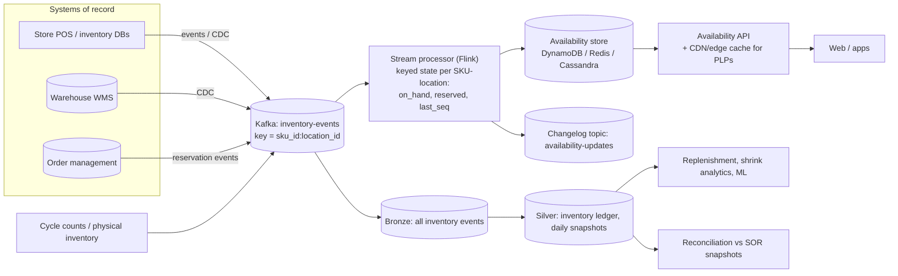

# Design Real-Time Inventory Availability for Omnichannel Retail

## Problem

A retailer sells through 2,000 stores, 15 warehouses, a website and apps. Customers see "in stock at your store" and "delivery by tomorrow". Inventory changes come from POS sales, returns, receiving, transfers, online orders and periodic stock counts. Design the data system that provides **accurate, low-latency availability** for the website and apps, prevents overselling, and feeds analytics (replenishment, shrink).

---

## Clarifying questions

| Question | Assumed answer |
|---|---|
| Scale? | 200k SKUs × 2,015 locations ≈ **400M SKU-locations** (≈ 50M with non-zero stock or activity) |
| Change rate? | ~30M inventory events/day, peak 5k events/s (Black Friday 25k/s) |
| Read rate? | Availability lookups: 50k QPS peak from web/apps |
| Freshness? | Availability within ~5 seconds of a sale or reservation |
| Correctness? | Never promise stock that doesn't exist for online orders (oversell is costly); slight under-promising is acceptable |
| Systems of record? | Store systems (POS, inventory), warehouse management system (WMS), order management system (OMS) |

## 1. Requirements

**Functional:** current on-hand per SKU-location; **available-to-promise (ATP)** = on-hand − reserved − safety stock; reservations for online orders; the event history for analytics; reconciliation with periodic physical counts.

**Non-functional:** p99 read latency < 50 ms; ATP freshness < 5 s; no lost events; correct under retries and reordering; graceful degradation when a store system is offline.

## 2. Estimates

- 30M events/day ≈ 350/s average, 25k/s peak; ~500 bytes per event → 12.5 MB/s peak: modest for Kafka (24-48 partitions).
- State: 50M active SKU-locations × ~100 bytes ≈ 5 GB of hot state: fits in a distributed KV store or stream-processor state comfortably.
- Reads: 50k QPS point lookups, which calls for a KV/cache serving layer, not the lakehouse.

## 3. Architecture

## 4. Data model

**Event (inventory ledger entry):** `event_id`, `sku_id`, `location_id`, `type` (SALE, RETURN, RECEIPT, TRANSFER_OUT/IN, ADJUSTMENT, COUNT, RESERVE, RELEASE, FULFIL), `quantity_delta`, `source_system`, `source_seq` (per location monotonic sequence), `event_ts`.

**State per SKU-location:** `on_hand`, `reserved`, `safety_stock`, `atp = max(0, on_hand - reserved - safety_stock)`, `last_source_seq` per source, `updated_at`.

The inventory is modelled as a **ledger** (append-only deltas) plus **derived state**, exactly like an accounting system. Counts set absolute values; everything else is a delta.

## 5. Deep dives

### 5.1 Ordering, duplicates and exactly-once state

- Key Kafka by `sku_id:location_id` so all changes for one SKU-location are ordered in one partition and processed by one Flink subtask.
- Each source provides a monotonic `source_seq` per location; the processor ignores events with `seq <= last_seq` for that source (dedup and replay safety) and buffers small gaps briefly before alerting.
- Flink checkpoints state and Kafka offsets together (exactly-once state); the KV sink is **idempotent** (it writes absolute state with a version, so replays converge).

### 5.2 Reservations and oversell prevention

- ATP alone (eventually consistent) can oversell when two customers buy the last unit simultaneously.
- **Reservation at checkout:** the OMS performs a **conditional write** on the availability store: decrement ATP if `atp >= qty` (DynamoDB conditional update / Redis Lua script). This is a strongly consistent per-item operation on the request path. On success it emits a RESERVE event so the stream processor and analytics see it.
- Reservations expire (TTL) if checkout isn't completed; RELEASE events restore ATP.
- **Safety stock** for store inventory accounts for its inaccuracy (items misplaced or stolen): promise only `on_hand − safety_stock` for ship-from-store and pickup.

### 5.3 Absolute counts vs deltas

- Physical counts (COUNT events) set `on_hand` to an absolute value as of the count time. Deltas with `event_ts` before the count must not be applied on top. Using the per-location sequence ordering (counts are sequenced too), the processor resets the baseline and then applies only later deltas.
- The difference between expected and counted (`shrink`) is emitted as an ADJUSTMENT for analytics.

### 5.4 Hot keys and peak events

- Hot SKUs (a console launch) concentrate reads, not writes per SKU-location: cache availability reads at the edge with short TTLs (1-5 s) and serve "low stock" states conservatively.
- For online-only inventory pooled at one warehouse, a single SKU-location can receive thousands of reservations per second. Split its stock into **N sub-buckets** (allocated quantities) to spread conditional writes, rebalancing periodically, the "sharded counter" pattern (see [hot keys](/interview-prep/learn/system-design/05-hot-keys/)).

### 5.5 Store systems offline

- Stores buffer events locally and replay; the per-location sequence lets the processor detect gaps.
- While a store is offline (no heartbeat), degrade its availability to "limited stock" / exclude it from pickup promises.

### 5.6 Reconciliation and analytics

- Nightly, compare the derived on-hand per SKU-location with snapshots from the store systems and the WMS; drift beyond tolerance triggers investigation and corrective ADJUSTMENT events.
- The lakehouse keeps the full ledger (bronze) and daily snapshots (silver) for replenishment forecasting, shrink analysis and auditing. State can be **rebuilt** from the ledger plus the last count.

## 6. Trade-offs

| Decision | Choice | Alternative |
|---|---|---|
| State computation | Stream processor with keyed state | Polling DBs (slow) or computing in the serving DB with triggers (couples systems) |
| Oversell prevention | Conditional writes at reservation time | Purely eventual ATP (oversells at low stock) |
| Serving | KV store + edge cache | Lakehouse/warehouse (latency, concurrency) |
| Store accuracy | Safety stock buffers | Promise raw on-hand (more cancellations) |
| Hot SKUs | Sub-bucket allocation | Single counter (contention) |

## 7. Failure modes

- **Processor restart:** restore from checkpoint; replay from committed offsets; the idempotent sink means no double decrements.
- **Duplicate POS uploads:** sequence-based dedup.
- **Out-of-order count vs sale:** sequence numbers per location order them correctly.
- **KV store region outage:** multi-region replication; reads fall back to cached or conservative availability; reservations fail closed (don't oversell).
- **Bad bulk adjustment from a store** (e.g. a fat-fingered count): anomaly detection on adjustment size; approval for large adjustments.

## 8. What separates a senior answer

- Modelling inventory as an **append-only ledger with derived state**, and absolute counts as baselines.
- **Per-key ordering and idempotency** via sequence numbers, plus exactly-once state.
- Distinguishing **eventually consistent availability** (display) from **strongly consistent reservations** (checkout).
- Handling hot items, offline stores and reconciliation explicitly.

## 9. Follow-up questions

How do you show availability on a product listing page with 50 items × 30 nearby stores?

Batch the lookup (a multi-get of 1,500 keys) against the availability store or a precomputed per-region availability summary; cache at the edge for a few seconds; return coarse states (in stock / low / out) rather than exact counts, which also tolerates small staleness.

Analysts want hourly inventory positions for 2 years. How do you store it efficiently?

Don't store hourly snapshots of 400M rows. Store the ledger (deltas) plus daily snapshots, and compute positions at any time as `snapshot + Σ deltas since snapshot`. Materialise only the aggregates analysts actually query (e.g. by category × region × day).

---

## Self-assessment rubric

- [ ] Ledger + derived state model; counts as absolute baselines
- [ ] Kafka keying by SKU-location; sequence-based dedup and ordering
- [ ] Exactly-once/idempotent state updates and sinks
- [ ] ATP definition with reservations and safety stock
- [ ] Conditional writes for oversell prevention on the checkout path
- [ ] Hot SKU handling (edge caching, sub-buckets)
- [ ] Offline store handling and reconciliation with systems of record
- [ ] Serving architecture meeting latency and QPS targets
