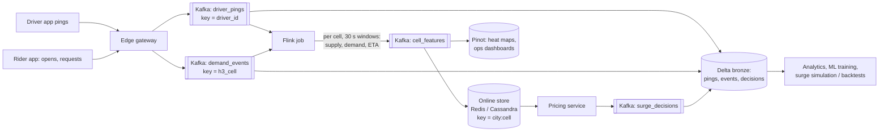
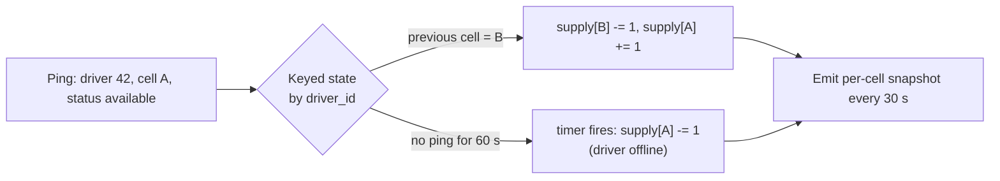

# Design the Data Platform for Ride-Hailing Surge Pricing

## Problem

Drivers send GPS pings every 4 seconds; riders open the app and request rides. The pricing service needs, **per small geographic area, every ~30 seconds**, the current supply (available drivers), demand (requests/app opens) and recent trend, to set a surge multiplier. Analysts need the history to tune the algorithm.

---

## Clarifying questions

| Question | Assumed answer |
|---|---|
| Scale? | 5 M active drivers at peak globally, ping every 4 s; 30 M ride requests/day; 500 cities |
| Latency? | Surge features updated every 30 s; end-to-end < 1 min |
| Area definition? | Hexagonal cells (H3 resolution ~8, ~0.7 km²) |
| Consumers? | Pricing service (online), driver heat map, analytics/ML |
| Late/out-of-order pings? | Common (bad connectivity); ignore pings older than 2 min for real-time |

## 1. Estimates

```
Pings: 5M / 4 s = 1.25M pings/s at peak × 100 B = 125 MB/s → Kafka 128–256 partitions
Requests/app-opens: ~5k/s
Active cells: ~1M worldwide; output 1M rows every 30 s → 33k rows/s to the feature store
Raw ping storage: 1.25M/s × 86,400 × 100 B ≈ 10 TB/day at peak rates → ~2 TB/day Parquet; retain raw 30–90 days, aggregates longer
```

## 2. Architecture



## 3. Deep dives

### 3.1 Geospatial bucketing

- Convert lat/lng → **H3 cell id** at ingestion (`h3.latlng_to_cell(lat, lng, 8)`). Hexagons have uniform neighbour distances; parent/child resolutions allow multi-scale aggregation.
- Surge per cell often uses a **k-ring** (the cell + neighbours) to smooth noise: supply in a cell's neighbourhood matters to riders at its edge.
- Alternatives: geohash (simple, rectangular, edge distortion), S2 cells (Google).

### 3.2 Supply = state, not a count of pings

A driver pings 7–8 times per 30 s. Counting pings per cell would overcount, so supply is **the number of distinct available drivers whose latest location is in the cell**.



- Flink keyed by driver_id maintains the driver's last cell + status; emits **deltas** to a second operator keyed by cell, which keeps running supply counts. Timers expire drivers who stop pinging.
- Demand: count of app opens / requests per cell in sliding windows (e.g. last 2 min and 10 min), deduped by rider.

### 3.3 Event time and out-of-order pings

- Use device timestamp with server-side sanity checks (clock skew). Keep only the latest ping per driver by event time (ignore older ones arriving late).
- Watermark small (e.g. 10 s) for real-time; very late pings are irrelevant to *current* supply but still go to the lake for analytics.

### 3.4 Feeding pricing safely

- The pricing service reads the latest features per cell; features carry `computed_at`. If features are stale (> 2 min, pipeline lag), pricing **falls back** (e.g. cap surge or use the last known value with decay) rather than pricing on stale data.
- Every surge decision is logged with its input features → **backtesting and simulation** of new algorithms on history (counterfactual analysis), and auditability (regulators ask about surge pricing).

### 3.5 Analytics data model

- `silver.driver_state_intervals`: driver × status × cell with start/end (sessionized from pings): supply-hours per cell.
- `silver.cell_minute`: cell × minute supply, demand, completed trips, surge applied, ETA.
- `gold.marketplace_health`: city × hour: utilisation, unfulfilled requests, avg surge.

## 4. Trade-offs

| Decision | Choice | Why |
|---|---|---|
| Engine | Flink | Keyed state with timers (driver expiry), ms-level processing, high throughput |
| Partitioning | Pings by driver_id, aggregation by cell | Correct per-driver state, then re-key for per-cell sums |
| Online store | Redis (city-sharded) | Low-latency reads by pricing; Cassandra if persistence + multi-DC needed |
| Spatial index | H3 | Uniform hexagons, hierarchical, open-source |
| Raw ping retention | 30–90 days | Volume is huge; keep derived intervals long-term |

## 5. Failure modes

| Failure | Handling |
|---|---|
| Flink job restart | State restored from checkpoint; supply counts consistent |
| City-wide network blip → no pings | Timers would mark all drivers offline → surge spikes! Detect sudden global supply drop, freeze surge / dampen changes |
| Hot cell (stadium event) | Cell-level aggregation is cheap; skew is at driver level, which is uniform |
| Stale features | Pricing fallback with staleness threshold |

## 6. What separates a senior answer

- Realises **supply is a stateful distinct count**, not a ping count, and handles driver expiry with timers.
- Uses a **spatial index** and smoothing over neighbours.
- **Safety mechanisms** in pricing for stale or anomalous data (the network-blip case is a great example).
- Logs decisions for **backtesting and audit**.

## 7. Follow-up questions

<details><summary>How would you compute "average ETA to pickup" per cell?</summary>

Join demand locations with nearby available drivers (k-ring) and road-network ETA estimates from a routing service; sample rather than compute for every request; aggregate per cell. Often a separate service owns ETA; the data platform provides features and logs.
</details>

<details><summary>How do you test a new surge algorithm without risking revenue?</summary>

Offline backtesting on logged features (counterfactual), then a switchback experiment (alternate algorithms by city × time slot, since user-level A/B testing causes marketplace interference), measuring conversion, wait times, driver earnings.
</details>

---

## Self-assessment rubric

- [ ] Estimated ping throughput and output size
- [ ] Geo bucketing (H3/geohash/S2) with reasoning
- [ ] Correct supply computation (latest state per driver, expiry)
- [ ] Two-stage keying (driver → cell)
- [ ] Late/out-of-order ping handling
- [ ] Pricing fallback on stale/anomalous data
- [ ] Decision logging for backtesting/audit
- [ ] Switchback experiments mentioned for evaluation
