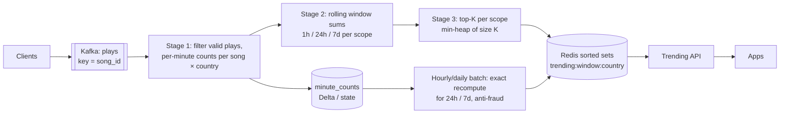

# Design Real-Time Top-K Trending

## Problem

Show the **top 100 trending songs** (or hashtags/products) in the last 1 hour, last 24 hours, and last 7 days, globally and per country. Updated every minute. Events: plays (or posts/views).

---

## Clarifying questions

| Question | Assumed answer |
|---|---|
| Volume? | 1 B play events/day, 3× peak; 50 M distinct songs, 200 countries |
| Freshness? | Lists refresh every 1 min |
| Exact or approximate? | Approximate ranking acceptable; counts within ~1% |
| "Trending" = most played or fastest rising? | Start with most played; discuss velocity as extension |
| Anti-gaming? | Exclude plays < 30 s, bots, repeated plays by the same user beyond N/hour |

## 1. Estimates

```
1B/day → 12k/s avg → ~35k/s peak; 200 B/event → 7 MB/s: modest
Naive exact state: 50M songs × 200 countries is the theoretical bound; actual (song, country) pairs active per hour ~20M
Per-minute partial counts: (song, country, minute) rows ≈ 20M/hour → fine for a streaming job
Output: 3 windows × 201 scopes × 100 rows ≈ 60k rows per refresh → tiny; serve from Redis/KV
```

## 2. Architecture



## 3. Deep dives

### 3.1 Sliding windows without recomputing everything

Store **per-minute buckets** (a "pane" approach). A 1-hour window = sum of the last 60 buckets. Each minute:

```
count_1h(song) += bucket[now](/interview-prep/practice/system-design/song/) − bucket[now − 60 min](/interview-prep/practice/system-design/song/)
```

Only songs that changed are touched. For 24 h and 7 d, use **hourly buckets** (24 and 168 of them): coarser granularity is fine for longer windows. This is how you avoid a 7-day sliding window with a 1-minute slide (10,080 overlapping windows per event!).

### 3.2 Top-K maintenance

- Per scope (global, each country) keep counts in keyed state and a **min-heap of size K** (or a sorted set). When a song's count changes, if it beats the heap minimum, it enters.
- Because counts also **decrease** (old buckets expire), heap entries can drop out. Simplest robust approach: every minute, for each scope, select top K from the candidate set (songs with nonzero counts in the window), which is cheap with partial pre-aggregation.
- **Distributed top-K:** each parallel task computes a local top-K' (K' = 2–5×K for safety), a final task merges. Note: local top-K merging is *approximate*: a song that's #150 everywhere locally could be #50 globally. Keying by song_id avoids this (each song's full count lives on one task); only the final merge of per-task top-Ks happens centrally.

### 3.3 Approximate counting at very large cardinality

If the key space is enormous (all hashtags, all URLs), use **Count-Min Sketch + heap** (heavy hitters):
- CMS gives an over-estimate of each item's frequency in fixed memory (e.g. width 2^20 × depth 5 ≈ 20 MB).
- Maintain a heap of top items whose estimated count exceeds the K-th.
- Sketches are mergeable across tasks and time buckets → per-minute sketches summed for the window.

### 3.4 Anti-gaming

Filter in stage 1: plays ≥ 30 s, cap counted plays per (user, song, hour), drop known bots, weight by account age. These need per-user state (TTL 1 h). Batch recompute applies heavier fraud logic and overwrites the 24h/7d lists.

### 3.5 Serving

Redis sorted sets: `ZADD trending:1h:DE score song_id`, written as a full replacement per refresh (write to a new key, `RENAME` atomically) so readers never see half-updated lists. Cache in CDN for 60 s: every user sees the same list per country.

## 4. "Trending" vs "popular"

Popular = highest count. Trending = **acceleration**: e.g. `score = count_last_1h / (avg hourly count last 7d + smoothing)`, or a z-score vs a baseline. Requires both short and long windows; already available from the bucket design. Add a minimum volume threshold to avoid "3 plays vs 0" spikes.

## 5. Trade-offs

| Decision | Choice | Alternative |
|---|---|---|
| Windowing | Per-minute/hour buckets + incremental sums | Native sliding windows (huge overlap, state explosion for 7 d) |
| Counting | Exact keyed counts (key space manageable) | CMS for unbounded key spaces |
| Serving | Redis + CDN | OLAP query at request time (unnecessary: results are tiny and shared) |
| Correction | Batch recompute for long windows | Streaming only (fraud filtering weaker) |

## 6. What separates a senior answer

- Avoids naive sliding windows; uses **panes/buckets**.
- Knows the **distributed top-K merge pitfall** and keys by item to avoid it.
- Brings in **count-min sketch** only when the key space requires it.
- Thinks about **gaming/fraud**, and about the output being tiny and cacheable.

## 7. Follow-up questions

<details><summary>How do you handle a viral song creating a hot key?</summary>

Stage 1 pre-aggregates per partition (local combiner) before keying by song, so one song's 10k plays/s become a few partial counts per task per minute. Salting with a second merge stage if needed.
</details>

<details><summary>How would you personalise trending (trending among people like me)?</summary>

Compute trending per segment (country × age band × top genre) as extra scopes, still cheap since output per scope is K rows; blend with personal recommendations at serving time. Cap the number of segments to control state.
</details>

---

## Self-assessment rubric

- [ ] Clarified popular vs trending, exact vs approximate
- [ ] Bucketed windows instead of naive sliding windows
- [ ] Correct distributed top-K strategy
- [ ] Mentioned count-min sketch / heavy hitters appropriately
- [ ] Anti-gaming filters
- [ ] Atomic serving updates + caching
