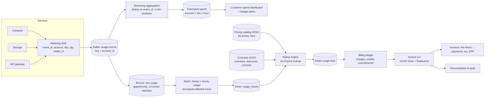
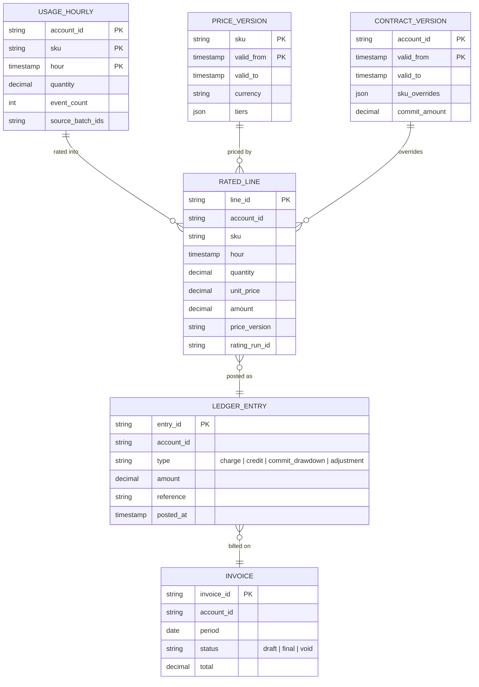

# Design a Usage Metering and Billing Pipeline

## Problem

A cloud data platform charges customers for usage: compute seconds, storage GB-hours, API calls and GPU tokens. Services emit usage events. Design the pipeline that turns raw usage into **accurate, auditable invoices**, near-real-time spend dashboards for customers, and budget alerts. Prices change over time, enterprise customers have negotiated rates, prepaid credits and annual commitments, and finance must be able to explain every cent.

---

## Clarifying questions

| Question | Assumed answer |
|---|---|
| Volume? | ~5B usage events/day from ~200 services, peak 150k events/s |
| Customers? | 80k accounts; 2k enterprise with custom contracts |
| Freshness? | Customer spend dashboard within 15 min; invoices monthly; budget alerts within 15 min |
| Correctness? | Invoices must be exact and reproducible; dashboards may be approximate (labelled "estimated") |
| Late events? | Most within minutes; some services batch-upload up to 72 h late |
| Corrections? | Yes: a service can emit corrections (e.g. a bug over-reported usage) and support can issue credits |
| Currency/tax? | Multi-currency; tax handled by a downstream tax service |

## 1. Requirements

**Functional:** ingest usage events; deduplicate; aggregate per account × SKU × hour; price with the rate effective at usage time (list price, contract overrides, tiers); apply credits and commitments in a defined order; produce invoices and line items; expose spend to customers; budget alerts; support corrections and restatements.

**Non-functional:** no lost or double-counted usage (effectively-once); reproducible invoices (re-running the month gives the same numbers); a full audit trail; isolation so one noisy service can't delay everyone; SOX-style controls on pricing changes.

## 2. Estimates

- 5B events/day × ~300 bytes ≈ **1.5 TB/day raw** (≈ 0.3 TB/day compressed Parquet); 150k events/s peak × 300 B ≈ 45 MB/s, so ~60 Kafka partitions gives plenty of headroom.
- Hourly aggregates: 80k accounts × ~30 SKUs actually used × 24 h ≈ **58M rows/day**, tiny compared with raw.
- Monthly invoice run: ~1.7B hourly rows per month to price and roll up, an easy batch job.

## 3. Architecture

**Two paths, one source:**
- **Fast path (estimated):** streaming aggregation for dashboards and alerts within minutes; approximate pricing (list or cached contract price).
- **Authoritative path (exact):** batch dedup, hourly usage, as-of rating, ledger and invoices, with a finalisation window for late events. The batch output **overwrites** estimated numbers once finalised.

## 4. Data model

Key choices: **money as decimals (or integer micro-units)**, never floats; **effective-dated (SCD2) prices and contracts**; an **append-only ledger** where corrections are new entries (adjustments), never edits.

## 5. Deep dives

### 5.1 Effectively-once metering

- Each usage event carries a deterministic `event_id` (e.g. a hash of service, resource and interval), so retries produce the same ID.
- Kafka producers are idempotent; consumers commit offsets after writing to bronze.
- **Dedup in the authoritative path:** `ROW_NUMBER() OVER (PARTITION BY event_id ORDER BY ingest_ts) = 1` within a lookback window (72 h + margin) when building hourly usage; streaming dedup with a watermark in the fast path.
- **Interval-based metering for continuous resources** (storage, running clusters): services emit usage per fixed interval with `(resource_id, interval_start)` as the natural key, so overlapping or retried reports collapse.

### 5.2 Late events and the finalisation window

- Hourly usage is recomputed for every hour touched by newly arrived events (partition by `usage_date`, process by arrival). This is idempotent partition overwrite.
- **Finalisation:** the month is closed at `month_end + 72h`; the invoice run then freezes the rated lines. Events arriving after close are billed in the **next** invoice as late usage (with original usage dates on the line), never by reopening a final invoice.
- Dashboards show "estimated" until finalisation.

### 5.3 Rating with historical prices

- As-of join: `usage.hour >= price.valid_from AND usage.hour < price.valid_to`, then contract overrides for the account at the same time (the contract version valid at usage time).
- **Tiered pricing** (first 1M calls at $X, next at $Y) depends on **cumulative monthly usage**, so rate in usage-time order per account and SKU with running totals (a window function over the month), not row by row in isolation.
- Every rated line records `price_version`, `contract_version` and `rating_run_id`, so any amount is explainable and reproducible.

### 5.4 Credits, commitments and ordering

- A defined **waterfall** applied in the ledger: charges → promotional credits (soonest-expiring first) → prepaid credits → commitment drawdown → invoice balance.
- Credits and commitments are ledger entries with validity windows; allocation is deterministic (stable ordering and tie-breaks) so re-runs give the same result. See the [credit ledger problem](/interview-prep/practice/python/32-credit-ledger-expiring-grants/).

### 5.5 Corrections and restatements

- A service bug over-reported usage for 3 days: the service emits **correction events** (negative quantities referencing the original interval) or support files an adjustment.
- Before the invoice is final: recompute affected hours and re-rate.
- After it's final: post an **adjustment ledger entry** (credit note) on the next invoice. Never mutate a sent invoice. The audit trail shows original, correction and reason.

### 5.6 Reconciliation and controls

- **Service-level reconciliation:** each service's own usage totals per hour vs the pipeline's metered totals (alert on > 0.1% drift).
- **Pipeline invariants:** events in (after dedup) = sum of hourly quantities; rated amount = Σ quantity × price per line; invoice total = Σ ledger entries.
- **Pricing changes** go through approval (four-eyes), are versioned, and can't be back-dated into finalised periods.
- **Shadow invoice runs** a few days before close, diffed against the previous month per account, flag anomalies (e.g. 10× spend jumps) for review before invoices go out.

## 6. Trade-offs

| Decision | Choice | Alternative |
|---|---|---|
| Real-time vs exact | Two paths: estimated streaming + exact batch | Streaming-only exact billing (harder late-data and correction handling) |
| Late data | 72 h finalisation, later usage on the next invoice | Reopen invoices (confusing for customers, breaks accounting) |
| Corrections | Append-only adjustments | In-place updates (no audit trail) |
| Money type | Decimal / integer micro-units | Floats (rounding drift across billions of lines) |
| Tiered pricing | Monthly running totals per account×SKU | Per-event tier lookup (wrong at tier boundaries) |

## 7. Failure modes

- **Metering agent outage:** buffered locally and replayed (late events path); alert on missing heartbeats per service.
- **Duplicate storm after a retry bug:** dedup on `event_id`; a dedup-rate monitor catches it.
- **Wrong price published:** approval flow, effective-date validation, the shadow-run diff catches it before invoices.
- **Rating job partial failure:** idempotent per-account/month partitions; rerun only failed partitions.
- **Clock skew in services:** reject or clamp future timestamps; use the service's interval key rather than wall-clock arrival.

## 8. What separates a senior answer

- Separating **estimated** from **authoritative** paths with explicit semantics for customers.
- Effectively-once metering via **deterministic event IDs and interval keys**.
- **As-of pricing** with SCD2 contracts and correct **tiered** pricing via running totals.
- An **append-only ledger** with adjustments, finalisation windows and a reproducible invoice run.
- **Reconciliation and financial controls** as first-class design elements.

## 9. Follow-up questions

A customer disputes a $40k line item. How do you explain it?

From the invoice line, follow `rating_run_id`, `price_version` and `contract_version` to the rated lines, then to the hourly usage rows and their source batch IDs, then to the raw events in bronze (13-month retention). Produce a usage breakdown by resource and hour with the price applied. Because everything is versioned and append-only, the explanation is reproducible.

How would you support real-time prepaid balance enforcement (stop service at $0)?

That's an operational, low-latency path: keep a balance per account in a strongly consistent store, decremented by the streaming estimated-spend aggregator with a safety margin, and have services check it on admission. The batch ledger remains authoritative and reconciles the balance daily; differences are corrected via adjustments.

Pricing moves from per-hour to per-second granularity. What changes?

Event volume per resource goes up unless services pre-aggregate; the hourly usage table can stay hourly (summing seconds), but rating must apply minimum charges and rounding rules at the new granularity. Version the pricing model and apply it by effective date so old periods keep the old rules.

---

## Self-assessment rubric

- [ ] Clarified freshness vs exactness, late data and corrections
- [ ] Deterministic event IDs / interval keys + dedup for effectively-once metering
- [ ] Separate estimated (streaming) and authoritative (batch) paths
- [ ] As-of pricing with SCD2 prices/contracts; tiered pricing with running totals
- [ ] Append-only ledger, credit/commitment waterfall, adjustments not edits
- [ ] Finalisation window and late usage handling on later invoices
- [ ] Reconciliation, shadow runs and pricing change controls
- [ ] Decimal money, auditability and reproducibility
