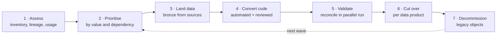
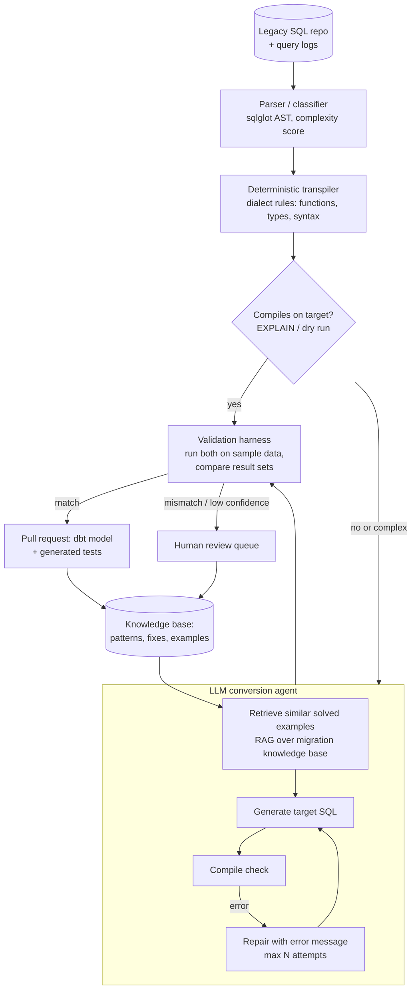

# Design a Legacy Warehouse to Lakehouse Migration

## Problem

An enterprise runs a legacy MPP warehouse (Teradata/Exasol/Oracle/Netezza) with ~3,000 SQL objects (views, procedures, scripts), 400 ETL jobs and 500 dashboards. It must move to a lakehouse (Spark SQL/dbt) within 18 months without breaking reports. Manual conversion is estimated at 20,000 engineer-hours. Design the migration approach and the tooling, including automated SQL translation.

---

## Clarifying questions

| Question | Assumed answer |
|---|---|
| Can the old and new systems run in parallel? | Yes, for up to 6 months per domain |
| Data sources? | The same upstream systems feed the legacy DWH; we can tap them directly |
| SQL complexity? | 60% simple views, 30% medium (window functions, dialect functions), 10% complex procedural scripts (loops, temp tables, dynamic SQL) |
| Acceptance criteria? | Business-signed reconciliation: results equal within defined tolerances |
| AI usage allowed? | Yes, with an enterprise LLM endpoint; no data leaves the tenant |

## 1. Strategy first, tools second

- **Assess:** parse all SQL to build a dependency graph; join with query logs to find what's actually used. Typically 30–50% of objects are dead, so **don't migrate dead code**.
- **Waves by domain/data product**, ordered by dependencies (leaf-up) and business value.
- **Re-platform first, then optimise**: lift-and-shift logic with minimal redesign, then refactor hot spots. Redesigning everything during migration is how 18-month projects become 4-year projects.

## 2. Architecture of the conversion factory

### 2.1 Deterministic first, LLM second
- A rule-based transpiler (e.g. sqlglot dialect translation + custom rules) handles the 60% simple cases **deterministically**: cheap, predictable, auditable.
- The LLM agent handles what rules can't: procedural logic → set-based SQL/dbt, dialect-specific functions without equivalents, dynamic SQL.
- **RAG over a migration knowledge base** (previously converted pairs, dialect mapping docs, team conventions) massively improves consistency; every human fix becomes a new example.

### 2.2 Validation is the product
LLM output is a *proposal*. Trust comes from validation:
1. **Compile/EXPLAIN** on the target (syntax, types, object resolution).
2. **Result equivalence** on representative data: run legacy and converted queries on the same snapshot, compare row counts, column-level checksums/aggregates, and row-level diffs on keys (with tolerance for float rounding, timestamp precision, NULL ordering, collation differences).
3. **Generated tests** (unique/not_null on keys, accepted values) added to the dbt model.
4. Confidence score = f(path taken, repair attempts, validation coverage) → routes to auto-merge-candidate vs human review.

### 2.3 Classic dialect traps (good interview material)

| Trap | Example |
|---|---|
| NULL semantics in string concat | `'a' || NULL` is NULL in standard SQL; some dialects treat NULL as '' |
| Integer division | `5/2` = 2 in some engines, 2.5 in Spark SQL |
| Implicit casts | String-to-date comparisons accepted silently in one dialect, errors in another |
| Date functions | `ADD_MONTHS`, week numbering (ISO vs US), timezone handling |
| Sorting and collation | Case sensitivity, NULLS FIRST/LAST defaults |
| `QUALIFY`, `TOP`, `ROWNUM` | Syntax differences |
| Procedural code | Cursors/loops → set-based SQL or orchestrated dbt models |
| Temp tables / transactions | Map to CTEs, temp views, or intermediate models |

## 3. Data migration and parallel run

- Build bronze/silver from **the original sources** (CDC), not from the legacy DWH, where possible. Otherwise you inherit legacy quirks forever. Use one-off historical loads from the legacy DWH for history that sources no longer hold.
- **Parallel run** per data product: both systems produce outputs daily; an automated **reconciliation job** compares key aggregates per business key and day, with a dashboard of match rates. Cut over when match is sustained for N days and the business signs off.
- **Dashboard repointing**: semantic layer or views with the same names in the new system reduce BI rework.

## 4. Program management signals (senior/staff)

- **Metrics:** objects migrated/validated per week, auto-conversion rate, human-hours per object, reconciliation match rate, legacy cost burn-down.
- **Freeze policy:** changes to legacy objects in a migration wave must be mirrored (or frozen) to avoid a moving target.
- **Decommission plan** with dates; otherwise both systems run forever and costs double.

## 5. Trade-offs

| Decision | Choice | Alternative |
|---|---|---|
| Conversion | Rules first, LLM agent for the long tail, humans for low confidence | Fully manual (slow), LLM-only (inconsistent, hard to trust) |
| Source of new pipelines | Original sources via CDC | Copy from legacy DWH (fast, inherits debt, keeps legacy alive) |
| Redesign | Minimal during migration, optimise after | Full redesign (risk, timeline) |
| Validation | Automated result-set comparison | Spot checks (misses edge cases) |

## 6. What separates a senior answer

- Starts with **inventory, usage and dependency analysis**, so dead code isn't migrated.
- **Validation harness** as the centre of the design: equivalence testing, not "the LLM said so".
- Deterministic transpiler + LLM agent + human loop, with a **learning knowledge base**.
- Knows **dialect traps** concretely.
- Parallel runs, reconciliation, sign-off, decommissioning.

## 7. Follow-up questions

How do you measure whether the AI conversion is actually saving time?

Baseline manual hours per object by complexity class (from a pilot). Track, per object: path (rules / agent / human), repair attempts, review time, defects found later. Report auto-validated rate and human-hours per object by class over time; the knowledge base should drive the curve down.

Result sets differ by 0.01% on a revenue view. Ship it?

Investigate first: usually rounding (decimal precision/scale, float), timezone/date boundary, NULL handling or duplicate rows from a join difference. Agree tolerances with the business beforehand; financial outputs typically require exact equality at the reported precision. Document known, accepted differences.

---

## Self-assessment rubric

- [ ] Assessment with usage + lineage; dead-code elimination
- [ ] Wave planning by dependency and value
- [ ] Conversion pipeline: deterministic + LLM + human, with RAG knowledge base
- [ ] Validation harness: compile, result equivalence, tests, confidence routing
- [ ] Concrete dialect traps
- [ ] Data landing from sources, parallel run, reconciliation, cutover
- [ ] Program metrics and decommissioning
